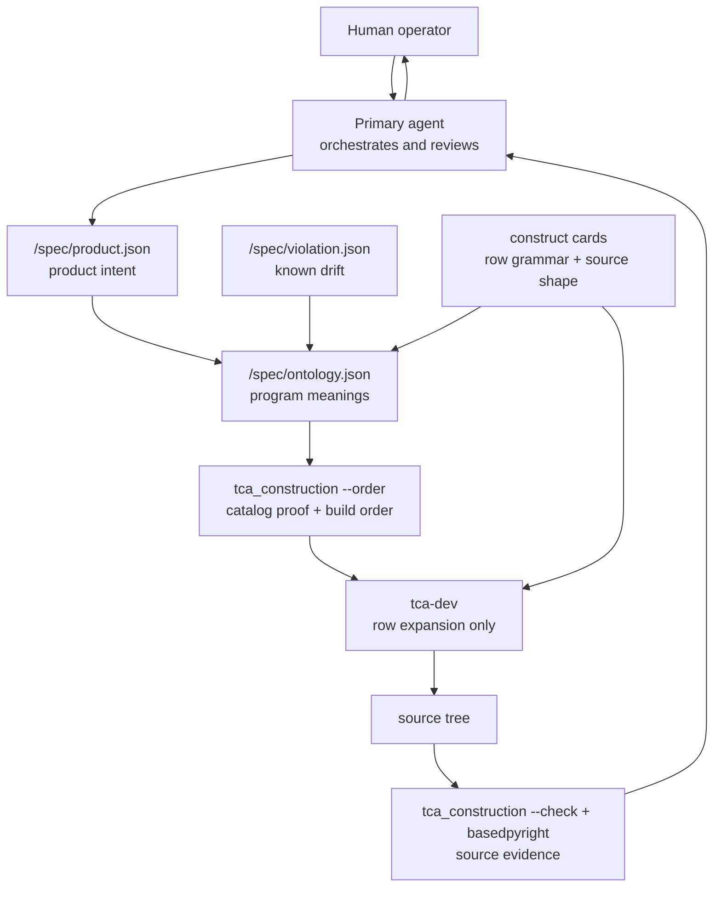

# The TCA Build System

This `.claude/` directory contains the human-directed build loop for Type Construction Architecture. Product intent is recorded, program meaning is modeled into ontology rows, rows are expanded through construct cards, and the gate returns evidence about catalog coherence and source conformance.

It does not ask a general coding agent to remember TCA while writing Python. It separates authority, constrains construction, and verifies the result against the ontology. This is AI-native development with human review, not autonomous software generation.

## Operating Terms

- **Product intent**: the product purpose, users, non-goals, and feature intent in `<target>/spec/product.json`, stated without implementation shape.
- **Ontology row**: one named program meaning placed in exactly one construct home in `<target>/spec/ontology.json`.
- **Violation ledger**: `<target>/spec/violation.json`, the list of tree content the ontology cannot explain yet.
- **Construct card**: a skill file that carries a classification rule, row grammar, exact source form, allowed and forbidden patterns, and halt rule.
- **Row expansion**: `tca-dev` rendering ontology rows through construct cards in the order the gate prints.
- **Source conformance**: a claimed source file matching the ontology rows that name it.
- **Deterministic gate**: `.claude/scripts/tca_construction`, the package that proves catalog order and checks source conformance.

## Catalogs

The build loop has four catalog roles, co-located in the build target: two durable models and two draining queues. Each target is a root like `src` or `demo`, holding the `app` package and its own `spec/` (product, ontology, violation, missing); the gate finds the catalog by walking up to it, so paths shown as `spec/...` are relative to the target a build names. There is no single repo-root spec. Each catalog's shape is a composed Pydantic model in the gate (`ProductIntent`, `OntologyCatalog`, `ViolationLog`, `MissingLog`), so the schema is dumped from the model, never hand-copied.

- **Product catalog** (durable): product purpose and feature intent. It states what the app is for, who acts, what is out of scope, whose data format crosses a boundary (`data_format`), and whether the world moves (`before`/`after`). It never names implementation.
- **Ontology catalog** (durable): the program as named meanings and construct rows. Each row carries one meaning, selects one construct home, records references, and maps back to product features. The construct card owns row grammar and source form.
- **Violation ledger** (queue): condemned tree content the ontology cannot explain yet. An entry records what was found, which break it is, and a pointing note. It drains: it leaves only when the violation leaves the tree, and `--order` rejects an entry whose condemned file is already gone.
- **Gap queue**: `<target>/spec/missing.json`, what the builder could not expand. An entry is an observation only (`source`, `card`, `builder_observation`), never a diagnosis. It drains: the modeler reconciles it and removes it, and `--order` rejects a gap whose row no longer names an ontology row.

The human reads the catalogs as design. The gate validates catalog coherence and claimed source. The language model fills construct cards instead of inventing shapes.

## Targets

A target is a root holding an `app` package and a co-located `spec/`: `src` (the clean scaffold a developer starts from) or `demo` (a worked example). Selecting one is convention, not configuration:

- **Build target**: the root named in the agent dispatch, per build. The gate self-targets by walking up to the target's `spec/`; nothing points a path at it, and there is no global setting.
- **Run target**: `PYTHONPATH=<target> uv run --env-file env/.env.dev python -m app.main` (the package is `app` under the target root, so `PYTHONPATH=src` or `PYTHONPATH=demo` selects which), or compose. Runtime environment files are copied from `env/.env.dev.example` or `env/.env.prod.example`; the build never reads them.

Switching between the demo and the dev scaffold is just naming a different root. Where the source sits is the target, for the gate at build time and for the run command at run time.

## Authority Boundaries

- **Human operator** decides product judgment, doctrine changes, irreversible actions, and final acceptance.
- **Primary agent** coordinates agent dispatches, reviews artifacts, diagnoses blocks, runs proofs, and escalates only what the record cannot settle.
- **`tca-product`** owns product intent. It never names constructs, fields, files, routes, or implementation.
- **`tca-ontology`** owns program meanings and the violation ledger. It writes no source and never invents constructs or procedures.
- **`tca-dev`** expands rows. It writes source, models nothing, and halts the moment a row will not expand through its card.
- **`tca_construction`** proves catalog coherence and source conformance. It follows the construct cards and doctrine; it does not invent doctrine.

## The Loop

1. `tca-product` writes or revises `<target>/spec/product.json` when product purpose or feature intent is missing.
   Evidence: product facts changed, features changed, and open product questions are reported.
2. `tca-ontology` writes or revises `<target>/spec/ontology.json` and `<target>/spec/violation.json`.
   Evidence: context names, ontology rows, feature-to-row mapping, reachability notes, and ledger delta are reported.
3. The operator reviews product facts, ontology rows, feature mappings, and ledger entries before source is built.
   Evidence: every row is re-derived against doctrine, and every ledger entry is accepted or rejected.
4. The gate runs `uv run python .claude/scripts/tca_construction --order <target>/spec/ontology.json`.
   Evidence: the catalog constructs, coherence checks pass, stale ledger entries fail, and build order prints.
5. `tca-dev` expands rows through construct cards in the printed order.
   Evidence: after every file, `tca-dev` runs `--check <file>` and `basedpyright <file>`; where a row will not expand it records the gap in `<target>/spec/missing.json`, takes its skip set from `--dependents`, and continues with the rows the gap does not block.
6. The operator verifies the built result.
   Evidence: `--check`, `basedpyright`, and the row-to-file mapping match the ontology.

Subagents cannot spawn subagents. The main agent orchestrates agent dispatches and reviews their artifacts. Completion is never an agent's assertion; it is the passing gate, passing type check, and matching row-to-file mapping.

## What The Gate Proves

The gate proves two local facts:

- **Catalog coherence**: every reference resolves, union and ordered-union variants pin their axes, topology rules hold, existing rows name real classes, stale ledger entries are rejected, and a build order exists.
- **Row-to-source conformance**: a class, alias, route, verb, or config in a file the ontology claims matches the row that gave it permission to exist.

The hook in [`settings.json`](settings.json) runs the gate before main-agent writes. Subagent tool calls do not receive that hook, so `tca-dev` is governed by its required `--check <file>` and `basedpyright <file>` loop after every file. The hook is a guardrail, not the whole fence; the no-unmodeled-source guarantee lives in row-driven build plus operator review.

See [`scripts/tca_construction/README.md`](scripts/tca_construction/README.md) for the full gate architecture, modes, targeting rules, and hook invocation.

## Agents

- [`agents/tca-product.md`](agents/tca-product.md): owns `<target>/spec/product.json`. It records purpose, users, non-goals, and feature intent, never constructs, fields, files, routes, or implementation.
- [`agents/tca-ontology.md`](agents/tca-ontology.md): owns `<target>/spec/ontology.json` and `<target>/spec/violation.json`. It names contexts, meanings, construct homes, references, feature mappings, and violations.
- [`agents/tca-dev.md`](agents/tca-dev.md): writes source only by expanding ontology rows through construct cards. It models nothing and halts when a row will not expand.
- [`agents/tca-llm-content.md`](agents/tca-llm-content.md): edits LLM-facing text while preserving doctrine, rules, construct boundaries, and detection cues.

The main agent's frame is [`../CLAUDE.md`](../CLAUDE.md). It coordinates the agents, reviews their artifacts, runs proofs, diagnoses blocks, and escalates only what the record cannot settle.

## Construct Cards

Construct cards are the constraint surface. They are not advice or style guides. Each card carries four things:

1. A classification rule: which meaning the construct carries and which adjacent meanings belong elsewhere.
2. A row grammar: what `<target>/spec/ontology.json` must record for that construct.
3. An exact source form: what `tca-dev` may render.
4. A halt rule: when a row cannot expand and the builder must stop.

This is why `tca-dev` has no modeling discretion. The ontology row says what; the card says how; the file matches or the build halts.

Construct cards:

- [`skills/tca-construct-binding/SKILL.md`](skills/tca-construct-binding/SKILL.md)
- [`skills/tca-construct-collection/SKILL.md`](skills/tca-construct-collection/SKILL.md)
- [`skills/tca-construct-composition-root/SKILL.md`](skills/tca-construct-composition-root/SKILL.md)
- [`skills/tca-construct-concept-model/SKILL.md`](skills/tca-construct-concept-model/SKILL.md)
- [`skills/tca-construct-config/SKILL.md`](skills/tca-construct-config/SKILL.md)
- [`skills/tca-construct-consistency-model/SKILL.md`](skills/tca-construct-consistency-model/SKILL.md)
- [`skills/tca-construct-contract-model/SKILL.md`](skills/tca-construct-contract-model/SKILL.md)
- [`skills/tca-construct-derivation/SKILL.md`](skills/tca-construct-derivation/SKILL.md)
- [`skills/tca-construct-foreign-model/SKILL.md`](skills/tca-construct-foreign-model/SKILL.md)
- [`skills/tca-construct-ordered-union/SKILL.md`](skills/tca-construct-ordered-union/SKILL.md)
- [`skills/tca-construct-route/SKILL.md`](skills/tca-construct-route/SKILL.md)
- [`skills/tca-construct-semantic-scalar/SKILL.md`](skills/tca-construct-semantic-scalar/SKILL.md)
- [`skills/tca-construct-union/SKILL.md`](skills/tca-construct-union/SKILL.md)
- [`skills/tca-construct-value-object/SKILL.md`](skills/tca-construct-value-object/SKILL.md)
- [`skills/tca-construct-verb/SKILL.md`](skills/tca-construct-verb/SKILL.md)

System cards:

- [`skills/tca-jargon/SKILL.md`](skills/tca-jargon/SKILL.md): the closed construct vocabulary.
- [`skills/tca-topology/SKILL.md`](skills/tca-topology/SKILL.md): file placement, import direction, and naming law.
- [`skills/tca-construct-skill/SKILL.md`](skills/tca-construct-skill/SKILL.md): how construct cards themselves are written.

## Failure Modes

- Missing or ambiguous product purpose goes to `tca-product`.
- A mis-modeled meaning, unresolved reference, wrong construct home, or missing construct goes to `tca-ontology`.
- A row that cannot expand makes `tca-dev` record the gap in the gap queue and continue with rows it does not block; the `SubagentStop` hook then fires `remediate_missing`, which surfaces each open gap for `tca-ontology` to drain. The builder never improvises a source shape.
- Known bad tree content is recorded in `<target>/spec/violation.json` until the violation leaves the tree.
- A stale ledger entry fails `--order`; the ledger cannot outlive the condemned file.
- A gate denial is evidence, not a suggestion to route around. Fix the ontology or fix the file to match it.
- A passing agent report is not completion. Passing gate, passing basedpyright, and matching row-to-file mapping are completion evidence.

## Read By Task

- To understand the doctrine, start with [`../docs/learning-path.md`](../docs/learning-path.md).
- To inspect enforcement, read [`scripts/tca_construction/README.md`](scripts/tca_construction/README.md), then `model.py`, `audit.py`, and `cli.py`.
- To modify agent roles, read the target file in [`agents/`](agents/) and the authority boundaries above.
- To add or revise a construct card, read [`skills/tca-construct-skill/SKILL.md`](skills/tca-construct-skill/SKILL.md) first.
- To review a build, compare `<target>/spec/ontology.json`, the `--order` output, the files `tca-dev` reports, `--check`, and `basedpyright`.
- To understand hook coverage, read [`settings.json`](settings.json) and the targeting section of [`scripts/tca_construction/README.md`](scripts/tca_construction/README.md).
