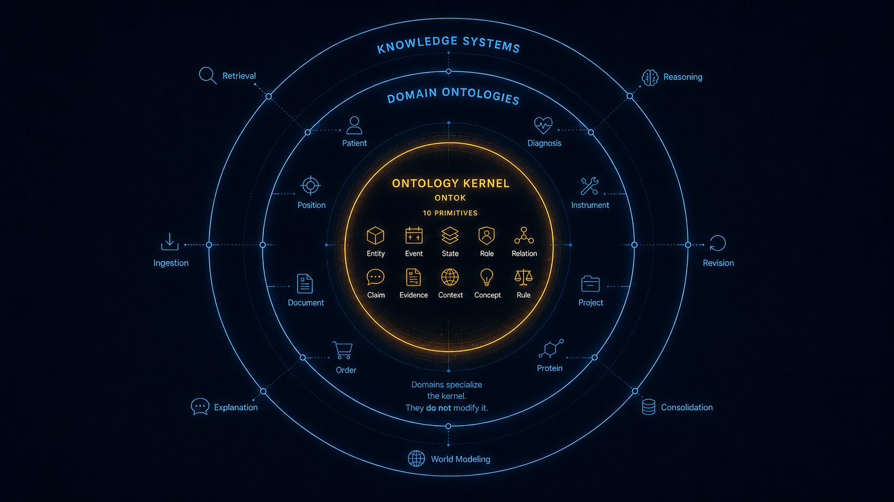

# ONTOK — the Ontology Kernel

<p align="center">
  
</p>

ONTOK is a minimal conceptual kernel for machine knowledge systems. It is not an ontology of any domain and not a storage engine. It is the smallest trusted layer that sits *underneath* domain ontologies and knowledge stores: the fixed set of primitives from which arbitrary domains can be represented, extended, retrieved, revised, and reasoned over without each one reinventing identity, time, evidence, and context for itself.

This repository declares that kernel and gives it a concrete, typed form.

## The idea in one paragraph

Modern AI systems hold the same knowledge in incompatible shapes at once: documents, embeddings, a graph, the prompt window, and application code. Each solves a different problem, and none of them says what the system actually *knows*. So identity, temporal validity, contradiction, provenance, and context get reconstructed, differently, inside every component. ONTOK's claim is that there is a small, stable core those components should all specialize against instead. Name that core once, deliberately, and the rest of the system can specialize it rather than re-derive it.

The name is meant literally. Like an operating-system kernel, ONTOK is small, stable, and hard to change on purpose. Domain ontologies are supposed to *specialize* it, never modify it. A healthcare model adds `Patient` and `Diagnosis`; a financial model adds `Position` and `Instrument`; neither redefines how identity, events, evidence, scope, or temporal validity work. That is the kernel's whole job: keep those foundations consistent across domains.

## The ten primitives

The kernel is ten conceptual primitives. They are intentionally abstract: they do not describe the world, they are the machinery from which descriptions of the world are built. "Person" is not a primitive; it is a specialization of `Entity`. "Employment" is not a primitive; depending on domain semantics it is some composition of `Event`, `State`, `Role`, and `Relation`.

| Primitive    | Represents            | Why it earns its place |
|--------------|-----------------------|------------------------|
| **Entity**   | persistent identity   | deciding whether two references are the same thing across documents, sessions, systems, and time |
| **Event**    | occurrence and change | organizing episodes, transitions, actions, observations, and historical sequence |
| **State**    | condition over an interval or scope | separating current truth from historical truth |
| **Role**     | contextual participation | letting an entity participate differently in different contexts without becoming a different entity |
| **Relation** | typed connection      | traversal, dependency discovery, structured retrieval |
| **Claim**    | assertion status      | not every extracted statement is settled; claims are supported, contradicted, revised, merged, deprecated, or promoted |
| **Evidence** | support               | keeping every assertion traceable to a source span, message, transcript, API result, or observation |
| **Context**  | scope                 | preventing local truths from being treated as universal truths |
| **Concept**  | reusable classification | the specialization point where domain ontologies extend the kernel |
| **Rule**     | governance            | constraints, derivations, identity policy, contradiction policy, retrieval policy |

## The design criterion

Traditional ontology work asks whether a category is *correct*, whether it carves reality the right way. ONTOK refuses that question and substitutes an operational one:

> Does removing this primitive make the machine materially worse at acquiring, organizing, retrieving, revising, explaining, reasoning over, or consolidating knowledge?

A primitive stays only if its removal degrades one of those operations. Conceptual elegance is not evidence. This is what lets the kernel claim to be *minimal*: minimality is testable rather than argued.

The sharpest form of the test is retrieval. To retrieve correctly a system has to distinguish persistent identity from temporary state, observation from asserted knowledge, historical truth from current truth, local context from global validity, evidence from inference, and relationship from coincidence. A system that cannot draw those lines cannot retrieve reliably no matter how good its embedding model is. So **retrieval is the kernel's falsifier, not its definition.**

## Knowledge is layered

Raw observation is not yet knowledge. The kernel encodes a progression from what was seen to what is believed to what is stable:

```text
Evidence
  -> Claims
  -> Entities, Events, States, Relations
  -> Domain Concepts
  -> Derived Knowledge
```

This ordering is the point of the whole exercise. It separates observation from belief, and belief from stable knowledge, which is exactly what lets a system revise a conclusion without losing the history that produced it.

## Declared and learned structure

ONTOK does not assume the conceptual structure must be hand-authored. A learned world model can have stable internal organization with no human-readable declaration. The distinction that matters is not symbolic versus learned; it is *implicit versus explicit* structure. Practical systems will do both: let learning propose new concepts while preserving an explicit foundation for interoperability, explanation, governance, and long-term consistency. ONTOK is that explicit foundation.

## What is in this repository

The kernel formalized as immutable, validated types.

```text
src/ontok/
  domain/schema/
    base.py         OntokModel (frozen, extra="forbid"), TimeInterval, shared id/label/description/metadata
    constructs.py   the ten primitives, each pinned by a `kind` literal
```

Every primitive is a frozen Pydantic model over a shared `OntokModel` base, so kernel objects are immutable by construction and reject unmodeled fields. Each carries a `kind` discriminator. The knowledge-construction edges are explicit in the types: `Evidence` records what it observed, `Claim` carries `evidence_ids`, `confidence`, and `revises`/`contradicts` links to other claims, and `Context`, `TimeInterval`, and `Concept` references thread scope, time, and classification through the rest.

```python
from ontok import schema

fact = schema.Claim(
    id="c1",
    label="ACME acquired Foo",
    subject_id="acme",
    predicate="acquired",
    object_id="foo",
    evidence_ids=("e1",),
    confidence=0.9,
)
```

## Status

Early. The ten primitives and their base are defined and importable. The kernel is deliberately small and is meant to stay that way; growth belongs in domain ontologies that specialize it, and in the operations (ingestion, consolidation, retrieval, revision, explanation) that the primitives exist to serve.

## Reading

- [`docs/ontology_kernel.md`](docs/ontology_kernel.md) — the full argument: the problem, the research question, the primitives and their responsibilities, and the relationships to retrieval and storage.
