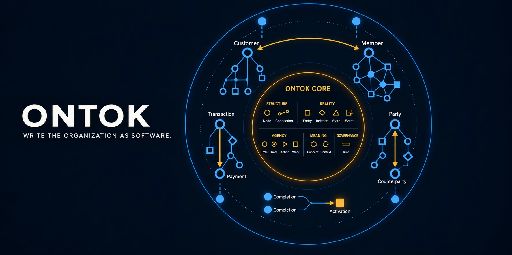

<p align="center">
  
</p>

# ONTOK

**A semantic language for writing the organization as software.**

An organization already has a model of itself: what exists in it, what happens, who does what, through which office, toward which end, under which rules. That model lives in people, and every application rebuilds a fragment of it. ONTOK gives it one home. Core is thirteen primitives that say what kinds of things an organization contains. An organization refines them into its own kinds. Its programs construct facts that satisfy those kinds, and a fact exists only because it was proven.

That is what makes the meaning software-addressable. Applications, agents, and models operate over the organization's own kinds instead of each inventing another model of them, and none of them has to become the authority that defines what the organization is.

## Core

| Family | Primitives | What they distinguish |
|--------|------------|-----------------------|
| Structure | `Node`, `Connection` | A distinct thing, and a link between two things that exist independently of it |
| Reality | `Entity`, `Relation`, `State`, `Event` | A thing that persists, an identifiable association, a condition that goes on a thing, an occurrence |
| Agency | `Role`, `Goal`, `Action`, `Work` | An organizational capacity, an intended end, declared doing through a role toward a goal, the persistent undertaking of it |
| Meaning | `Concept`, `Context` | What a declaration means, and a situation constituted by states |
| Governance | `Rule` | A constraint on declared work within a situation |

Everything else in Core makes those construct: `NodeId`, `Timestamp`, `Instant`, `Interval`, and `States`. There is no fourteenth primitive, no `type` field, and no registry. **The class is the kind. The value is the fact.**

## Refine, construct, refuse

```python
from datetime import UTC, datetime

from pydantic import ValidationError

from ontok.core import Action, Entity, Event, Goal, Instant, NodeId, Role, State, Timestamp


class Customer(Entity): ...


class StrategicAccount(State):
    customer: Customer


class AccountManager(Role): ...


class AccountReviewed(Goal): ...


class ReviewAccount(Action): ...


class ReviewCompleted(Event):
    account: Customer


review = ReviewAccount(
    id=NodeId("0192a1b2-c3d4-7e5f-8a6b-7c8d9e0f1a2b"),
    role=AccountManager(id=NodeId("0192a1b2-c3d4-7e5f-8a6b-7c8d9e0f1a2c")),
    goal=AccountReviewed(id=NodeId("0192a1b2-c3d4-7e5f-8a6b-7c8d9e0f1a2d")),
)

completed = ReviewCompleted(
    id=NodeId("0192a1b2-c3d4-7e5f-8a6b-7c8d9e0f1a2e"),
    occurred=Instant(at=Timestamp(datetime.now(UTC))),
    account=Customer(id=NodeId("0192a1b2-c3d4-7e5f-8a6b-7c8d9e0f1a2f")),
)

try:
    ReviewCompleted(id=NodeId("not an identifier"), occurred=completed.occurred, account=completed.account)
except ValidationError:
    ...  # no such fact exists
```

A kind is a subclass that adds the fields it carries. A fact is a constructed value: every field proven, nested facts proven first, an existing fact accepted as prior proof. A `ValidationError` is not an error in the program; it is the absence of a fact. Nothing is checked afterward because nothing invalid got in.

Every Core model is frozen, closed to undeclared fields, and strict, and every refinement inherits that unchanged. Ordinary Python, ordinary Pydantic, and the facts are ordinary program values.

## The module is the specification

ONTOK is not defined by Python. Its meaning is stated once, in each module: the class is the kind, its docstring is what it means, its fields are what it requires. The Python realization is that statement made executable, and any other realization or interchange form is projected from it.

Core is deliberately small and grows by modules. A capability becomes part of ONTOK by composing the kernel in a module that depends on Core one way, never by adding to Core.

## Use it

Core is a Python 3.13+ package in the `ontok` namespace and is installed from this repository:

```bash
pip install "ontok-core @ git+https://github.com/kyzobuild/ontok.git#subdirectory=packages/python/ontok-core"
```

- Status: alpha. The primitives are settled; the surface around them is not.
- [How Core is composed and why](wiki/architecture/ontok-core.md), stated as it is.
- [The ontological organization](docs/The-Ontological-Organization-Foundational-Thesis.md), the thesis behind it.

## License

ONTOK is licensed under the [Apache License 2.0](LICENSE).
