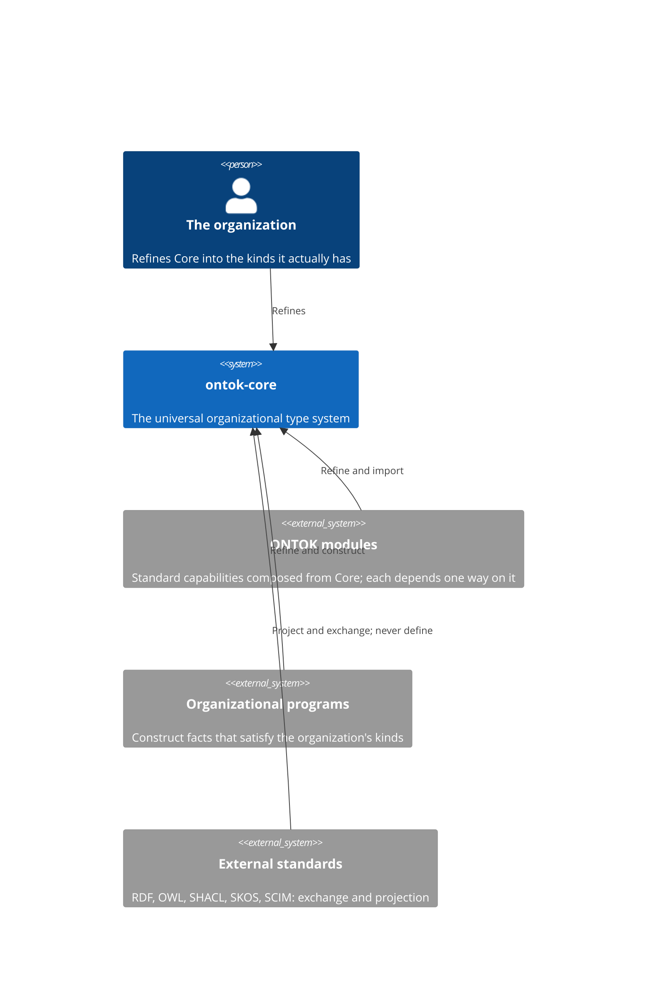
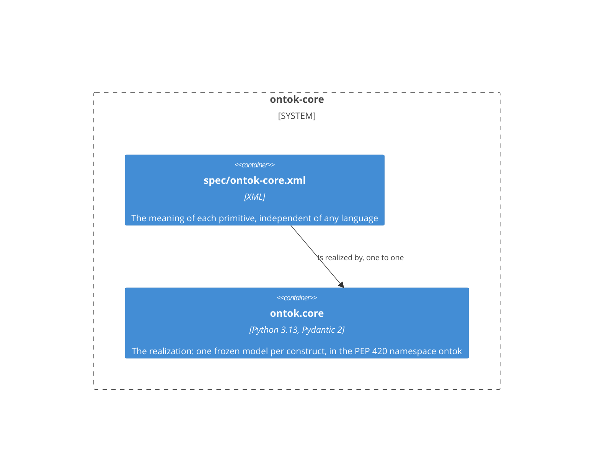
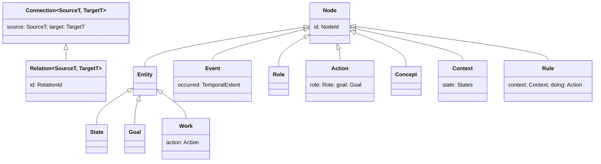

# ontok-core

Core is the ONTOK language: thirteen primitives that say what kinds of things an organization contains. An organization refines them into its own kinds, and its programs construct facts that satisfy those kinds. Core depends on Pydantic and on nothing else, and knows no module, no transport, and no application. Read this page before any structural change and edit the section the change lands in, in the same commit as the specification and the code; Git is the history.

## Constraints

- Core has exactly thirteen primitives: `Node`, `Connection`, `Entity`, `Relation`, `State`, `Event`, `Role`, `Goal`, `Action`, `Work`, `Concept`, `Context`, `Rule`. Everything else in Core makes their construction complete: `NodeId`, `RelationId`, `Timestamp`, `PositiveDuration`, `Instant`, `Interval`, `TemporalExtent`, `States`.
- The class is the kind and the value is the fact. A domain meaning is a refinement. No instance-level `type`, `kind`, `TypeId`, URI, or registry field exists.
- Every Core declaration is a frozen Pydantic model with `extra="forbid"`: the primitives and the temporal values as `BaseModel`, the identifiers and `States` as `RootModel`.
- The specification `spec/ontok-core.xml` is written from this realization and the two are one executable specification. A change to meaning touches both in one commit; a change to implementation alone leaves the specification untouched.
- Core imports no ONTOK package. The workspace's import-linter layers contract places every module above `ontok.core`.
- Python 3.13 or later; `pydantic>=2.9,<3`.

## Context

## Building blocks

The primitives form five families, and refinement is the only relationship among them:

Structure is `Node` and `Connection`. Reality is `Entity`, `Relation`, `State`, and `Event`. Agency is `Role`, `Goal`, `Action`, and `Work`. Meaning is `Concept` and `Context`. Governance is `Rule`. Each primitive's meaning is stated once, in the specification, and its docstring in the realization is that sentence.

## Construction

A fact comes to exist in three moves and no others.

1. **Refine.** An organization declares a kind by subclassing a primitive and adding the fields that kind carries. `class Customer(Entity)` is a kind; `class StrategicAccount(State)` with a `customer: Customer` field is a kind whose facts require a proven customer. A refinement adds; it never redeclares what it inherits.
2. **Construct.** A fact exists when its kind's constructor has established every declared field. Nested input constructs every constituent; an existing fact is accepted as prior proof. `Action` requires a proven `Role` and `Goal`; `Work` requires a proven `Action`; `Rule` requires a proven `Context` and `Action`.
3. **Refuse.** A `ValidationError` means no fact of that kind exists. An unknown field, a missing field, a mutation of a constructed fact, an identifier that is not a canonical UUIDv7, a timestamp without a timezone, a duration that is not positive, and a situation with no conditions are each refused at construction.

## Decisions

Each is stated as it stands. To change one, change it here, in the specification, and in the code in one commit.

**The class is the kind.** Domain semantics are refinements of the primitives, because a refinement is checked by the type system while a `type` field is checked by nothing. This rules out instance-level `type`, `kind`, `TypeId`, URI, and registry fields, and rules out any registry that maps names to classes.

**Core has thirteen primitives and grows by modules.** Core holds only the semantics every organization shares, because a kernel that fits every organization must be small enough to refine without contradiction. A capability becomes part of ONTOK by composing the kernel in a module with a one-way dependency on Core. This rules out adding a primitive because a capability needs representation.

**Work is a primitive.** `Action` is declared work and `Work` is its persistent undertaking, because declaring a doing and undertaking it are different facts with different lifetimes: an `Action` is stated once and a `Work` persists while it is carried out. This rules out treating a declaration as its own execution.

**An Event is an occurrence, not a cause.** `Event` carries when it occurred and nothing about why, because temporal sequence does not imply causation. Core declares no causal kind; a causal link is a `Relation` whose endpoints are `Event`s, declared by the module or organization that needs it. This rules out inferring cause from order.

**A Connection embeds its endpoints and is parameterized by their kinds.** `Connection[SourceT, TargetT]` holds a proven source and a proven target, because a link constructs only from nodes that already exist, and the type parameters let a refinement name the kinds it links. `Relation` is a `Connection` with its own `RelationId`. This rules out a link that names an endpoint no fact proves.

**Facts are frozen and closed.** Every model is `frozen=True` with `extra="forbid"`, because a fact never changes and a value carrying an undeclared field is a fact of a different kind. This rules out mutation, partial copies, and tolerated extra input.

**Time is a temporal extent.** An occurrence occupies an `Instant` or an `Interval`; a `Timestamp` carries its timezone and a `PositiveDuration` is strictly positive, because an occurrence takes a point or a positive span on the timeline and never zero. This rules out naive datetimes and zero-length intervals.

**Identity is a canonical lowercase UUIDv7.** `NodeId` and `RelationId` construct only from that form, because a UUIDv7 is globally unique without coordination and ordered by the moment it was minted. This rules out serial integers and identifiers minted from content.

**State is an Entity.** A condition that goes on an entity is itself a thing whose identity persists, because a condition is referred to, related, and governed in its own right. This rules out state as an attribute enumeration on the entity it goes on.

**A Context is at least one State.** `States` has a minimum of one, because a situation with no conditions is no situation. This rules out an empty context.

**A Rule binds a Context and an Action.** Governance is a constraint on declared work within a situation, composed from the same primitives as everything else, because a rule that lives outside the model cannot be checked against it. This rules out a separate rule engine with its own vocabulary.

**The specification defines the language; the realization makes it usable.** `spec/ontok-core.xml` and `ontok.core` are one executable specification and change together, because ONTOK is not defined by Python and a realization that drifts from its specification defines nothing. This rules out Python as the semantic authority.

**Modules depend one way.** Core imports no ONTOK package; every module imports Core and never learns of what imports it, because an imported meaning that knew its importers would no longer be universal. This rules out Core referring to any module.

**The namespace is `ontok`, implicit.** Each distribution owns exactly one import name under the PEP 420 namespace and distribution metadata is the sole version authority, because independently publishable modules must coexist in one installation without a shared package file. This rules out an `ontok/__init__.py` anywhere.

**Standards are projections.** RDF, OWL, SHACL, SKOS, and SCIM exchange or project ONTOK semantics, because they are interchange assets whose programming models are not ONTOK's. This rules out importing a standard's model into Core.

## Quality scenarios

| Scenario | Expected |
|----------|----------|
| A kind adds a field Core does not declare and constructs with it | Constructs; a refinement adds facts |
| A value is constructed with a field its kind does not declare | Refused |
| A constructed fact is assigned to | Refused |
| A `NodeId` is not a canonical lowercase UUIDv7 | Refused |
| A `Timestamp` has no timezone | Refused |
| An `Interval` has a zero duration | Refused |
| A `Context` has no `State` | Refused |
| A module imports a module above it | The import-linter layers contract fails |

## Glossary

| Term | Meaning |
|------|---------|
| Primitive | One of the thirteen kinds Core declares; everything an organization contains is a refinement of one. |
| Family | The grouping of primitives by what they distinguish: structure, reality, agency, meaning, governance. |
| Kind | A class: a primitive or a refinement of one. |
| Fact | A value: a constructed instance of a kind. |
| Refinement | A subclass that adds fields to a kind and inherits everything else unchanged. |
| Realization | A language's implementation of a specification, in which construction makes invalid declarations unrepresentable. |
| Executable specification | A module's XML specification and its realization taken together. |
| Module | A distribution that composes Core into a standard capability and depends on Core one way. |
