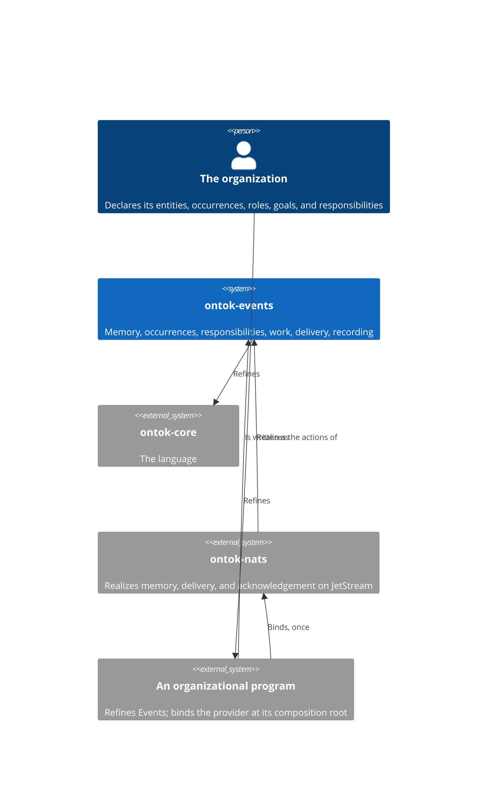
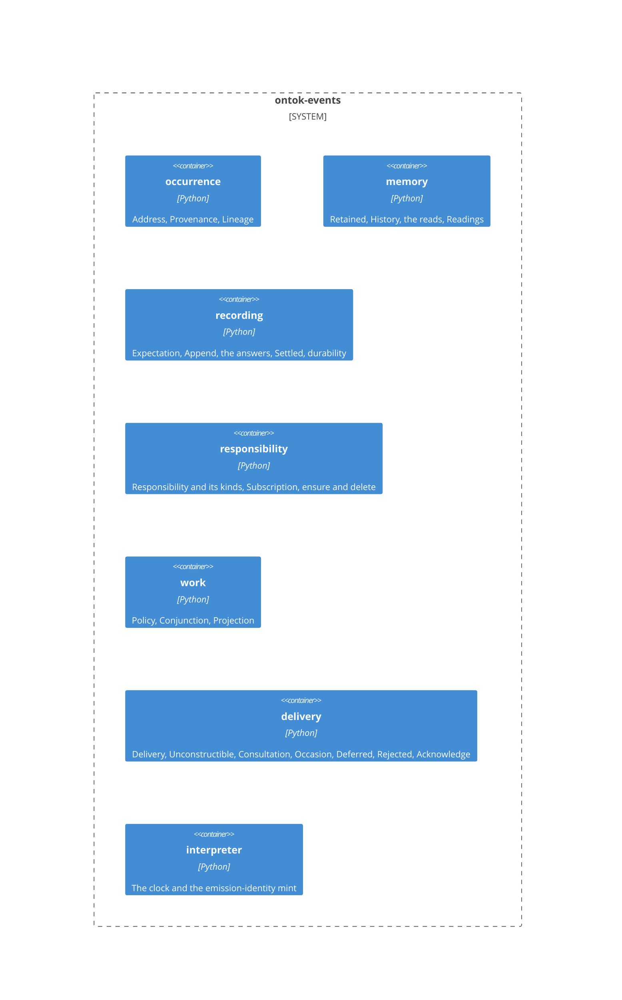

# ontok-events

Events is the module that makes the language executable. An organization remembers what occurred about its entities, and its declared work acts on those occurrences: reading an entity's history, deriving new occurrences, maintaining what it needs to answer questions. This module says what those facts are, in Core's terms, and nothing about how a provider carries them. `ontok-nats` realizes its actions; an application refines its kinds and binds the provider once. Read this page before any structural change and edit the section the change lands in, in the same commit as the code; Git is the history.

## Constraints

- Every declaration is one of the thirteen forms in the [python-development standard](../../.agents/skills/python-development/SKILL.md) and carries its mandatory configuration. There is no procedural orchestration anywhere.
- The module names no application type and carries no type parameter. Where it holds an application's event it types it as Core `Event`; where it needs an event's facts it constructs its own values from the event with `from_attributes=True`.
- Every identified kind is a refinement of a Core primitive. Identityless facts are standard constructs. The standard's effect actions describe external effects and are not Core `Action`s.
- Frozen values hold no client, process, or handle. SDK objects never cross the module's boundary.
- Programming defects are not caught; a defect crashes the process and redelivery makes it visible.
- Under `from_attributes` construction, class identity is not a fact; only attributes are. Every variant of an ordered union constructed from facts carries an attribute no other variant carries, and the variant that carries none is tried last.
- Python 3.14 or later, because emission identities are minted through `uuid.uuid7`. `ontok-core` and Pydantic; no other dependency.

## Context

## Building blocks

The module's constructs, by family:

```mermaid
classDiagram
  class Responsibility { work_type: WorkTypeName; consumes: tuple~EventTypeName~ }
  class ConjunctionResponsibility { work_type: WorkTypeName; first: EventTypeName; second: EventTypeName }
  class Policy
  class Conjunction
  class Projection
  class PolicyProvenance { work_type; cause: NodeId; position: Ordinal }
  class ConjunctionProvenance { work_type; first: NodeId; second: NodeId; position: Ordinal }
  class Retained { event: Event; sequence: LogSequence }
  class History
  class Delivery { token: DeliveryToken; event: Event; sequence: LogSequence }
  class Unconstructible { token: DeliveryToken; body: MessageBody }
  class Consultation { work; arrival }
  class Occasion { consultation; consulted: Readings; at: Timestamp }
  class MintedOccasion { emitted: EmittedIdentities }
  class Append { expectation; events: tuple~Event~; disposition }
  class Settled { answer; readings: Readings }
  Action <|-- Responsibility
  Action <|-- ConjunctionResponsibility
  Work <|-- Policy
  Work <|-- Conjunction
  Work <|-- Projection
  Occasion <|-- MintedOccasion
```

## Construction

How a fact comes to exist in this module, by family. Each declaration names the fact it proves, then its construct.

### Occurrences

- **A recordable event** refines Core `Event`, carries `event_type: Literal[<member>]` of the application's event-type `StrEnum`, whose values are `<namespace>-<Class>`, and derives `about: NodeId`, the entity it concerns. The `Literal` is interchange identity: it travels on the wire and in subjects, and renaming the class does not change it. Concept model; `Literal` discriminator admitted for interchange data.
- **`PolicyProvenance(work_type, cause, position)`** is how a policy's emission came to be: which responsibility derived it, the remembered occurrence it was derived from, and its position among that response's emissions. **`ConjunctionProvenance(work_type, first, second, position)`** is how a conjunction's emission came to be, naming both remembered occurrences in the responsibility's declared order. Value objects; `Provenance` is their union, and each derives `causes`, so what reads a provenance reads one name. A policy emission with two causes, or a conjunction emission with one, has no representation. An originating occurrence carries no provenance.
- **`Address`** locates one publication in memory and proves an event is recordable. `OriginAddress(about, event_type, id)` and `EmissionAddress(about, event_type, provenance)`, an ordered union constructed from an event with `from_attributes=True` through `AddressConstructor`; the only refusal of `EmissionAddress` over a constructed event is the absence of `provenance`, which is what an originating occurrence is. An address holds at most one event, for the life of memory.
- **`Lineage(id, provenance)`**, lifted from a derived event, derives `causation: tuple[Causation, ...]`, the Core connections from each of its provenance's causes to this event. Transformation; this is the ontology's "why", executable.

### Memory

- **`Retained(event, sequence)`** proves an occurrence is remembered, at that position in memory. It is constructible only from a read of memory. Concept model.
- **`History`** is an entity's remembered occurrences in log order, at least one; it derives `latest`, a selection by a proven key. Collection.
- **An entity's condition** is the fold of its history in the state-transition shape: each remembered occurrence succeeds the condition before it. The application owns the fold. A policy's emissions are the next steps of that one chain when they are remembered in turn.
- **The reads.** `ReadHistory(about)`; `ReadLatest(about, scope)` with scope `OfType(event_type)` or `EveryType`; `ReadAddress(address)`. Actions. A read's outcome is `Retained | Absent(about) | Unavailable(reason)`, or for a history `History | Absent | Unavailable`. Reads see memory as it is now.
- **`Readings`** is the collection of read outcomes in the declared order of the reads. A response reads them by declared position and by the type it requires, so a reading that is `Unavailable` where a `Retained` is required refuses the response, and a deferral requires an `Unavailable` at a position; no separate completeness fact is needed.

### Recording

- **A claim about memory.** `ExpectAny`: nothing is at this event's own address. `ExpectSequence(sequence)`: the latest remembered occurrence about the entity has this sequence. Value objects; `Expectation` is their union, constructed only in code.
- **`Append(expectation, events, disposition)`** commits occurrences to memory atomically under one claim: every event is remembered or none is. A response commits its emissions; a source commits its one originating occurrence, and both are the same act. `events` holds none to a thousand; the claim applies to the first, and every later event expects nothing at its own address. `disposition` is what remains for the append's author once it is durable: the disposition a response reached, or Complete for a source, because nothing follows a durable publication; the action carries it forward as the standard's `PersistPosition` carries its position, so the response is constructed once and its authority reaches the conclusion through the outcome that couples the action. Action; derives `lead` through the ordered union `Lead | NoLead`, where `Lead` reads the first event through `AliasPath("events", 0)` and the only refusal is an empty tuple; derives `reads` as its lead's reads. An append of no events makes no provider call and is `Written`.
- **Memory's answer** couples the append and owns the reads that settle it: `Written(append)` and `AppendUnavailable(append, reason)` derive no reads; `Contested(append, refusal)`, carrying memory's account of why the claim did not hold, derives its append's `reads`. Concept models; their union is the answer. Each carries a fact the others do not, except `Written`, which is why `Written` is what remains when nothing else constructs.
- **`Settled(answer, readings)`** is returned by the settle interpreter, whose action is the answer, coupling it. It derives `durability` through an ordered union constructed from itself with `from_attributes=True`, each variant holding its proof through an `AliasPath`, in this order: `AlreadyPresent(contested, existing)`, the address holds an event, so this publication is already remembered and this is success; `Conflict(contested, absent)`, another occurrence holds the position the claim required; `Unsettled(contested, unavailable)`, the settling read did not complete; `NotDurable(unavailable)`, the provider did not complete the append; and `Appended(written)`, what remains when the answer carried no refusal and no failure. Each derives the delivery's `disposition`: `Appended` and `AlreadyPresent` derive their append's; the other three derive Retry. A retry never records a second copy, however many occurrences have landed since.

### Responsibilities

- **A responsibility** is declared work that responds to occurrences: a refinement of Core `Action` carrying `work_type: WorkTypeName`, its interchange identity, which travels in provenance, subjects, and the provider's names. The application refines it and refines `Role` and `Goal`, so a kind of work says who does what, through which office, toward which end, in response to what. There is no separate specification of a kind of work; the `Action` is it.
- **Its kinds.** `Responsibility` adds `consumes`, at least one event type in declared order, and is what a policy or a projection undertakes; the two are one declaration, because what differs between them is the work, not the responsibility. `ConjunctionResponsibility` adds `first` and `second`, the two event types whose conjunction it acts on. Each derives `event_types` and `subscription`.
- **`Subscription(work_type, event_types)`** is a responsibility's standing interest in those occurrences, from the beginning of memory, independent of any process. Its name and deliver group are the `work_type`, so each delivery reaches exactly one running instance; its deliver subject is fixed, so a callback stays bound across deletion and recreation. Value object.
- **`EnsureSubscription(subscription)`** and **`DeleteSubscription(subscription)`**. Actions. Outcomes: `SubscriptionEnsured(subscription) | EnsureUnavailable(subscription, reason)`, coupling the subscription because the startup fact reads it; `SubscriptionDeleted(subscription) | Unavailable(reason)`.

### Work

- **`Policy(Work)`**, **`Conjunction(Work)`**, **`Projection(Work)`** are the standing undertakings of a responsibility: one instance per responsibility, declared at the composition root with a persistent identity, holding its responsibility as the inherited `action`. Each derives `responsibility` by lifting `action` through its responsibility kind with `from_attributes=True` (constructor composition, the same technique as `Address`). A policy derives occurrences from an entity's condition and an occurrence. A conjunction derives occurrences when two kinds of occurrence about one entity have both happened. A projection maintains a read model and derives no occurrences. Nothing per delivery is a `Work`; what happens per delivery is a response, a fact.

### Delivery

- **`Delivery(token, event, sequence)`** is memory handing a remembered occurrence to a responsibility, possibly more than once; the token is the provider's acknowledgement address. Concept model; derives `retained`, `address`, and `abouts`, the entity concerned. **`Unconstructible(token, body)`**: what arrived is not one of this program's occurrences, and the body it lifts from the route's `event` is the witness, never read. The arrival is their ordered union, constructed from the application's route with `from_attributes=True` through `ArrivalConstructor`; `Delivery.event` refuses only a `MessageBody`, and `Unconstructible.body` accepts only one, so each is proven by an attribute the other lacks. A delivery token never enters a response.
- **The application's route** is one model, `DeliveryRoute`: the token through the alias `reply`, the sequence through an `AliasPath` into the provider's message metadata, and the body through the alias `data` as the ordered union `Json[<its event union>] | MessageBody`, where `MessageBody` is this module's scalar over an arrival's bytes and every refusal of the program's events means the body is not one of them. Only `Unconstructible` holds the body, as its witness.
- **`Consultation(work, arrival)`** is what memory a work consults for an arrival. `PolicyConsultation` derives one `ReadHistory` for each of the arrival's `abouts`; `ConjunctionConsultation` derives, for each, a `ReadLatest` of `OfType(first)` then `OfType(second)`; `ProjectionConsultation` derives none. An `Unconstructible` arrival has no `abouts`, so it authorizes no reads. Transformations. Each read executes through its own one-action interpreter; `Readings` constructs at the composition root from their outcomes.
- **`Occasion(consultation, consulted, at)`** is the situation work faces: what was asked of memory, what memory answered, and when. `MintedOccasion(Occasion)` adds `emitted: EmittedIdentities` for a policy or a conjunction. Concept model; derives `work` and `action`. This is where `Context` and `Rule` attach when the organization's governance is evaluated.
- **The response** is constructed from the occasion through the `TypeAdapter` the application declares beside the kind's response union, a plain union of which exactly one variant constructs, because each is proven by an attribute the others lack: a variant the application declares, the work having responded, requiring the arrival's `event` of the kinds it responds to and `Retained` readings at the positions it declares; `Deferred(unavailable)`, requiring an `Unavailable` at the first position, and `DeferredSecond(unavailable)` at the second, memory could not be consulted; `Rejected(arrival)`, requiring an `Unconstructible` arrival, proven by its body. A response that refuses for any other reason constructs nothing, and the process crashes as a defect. The application's variants refine `Response(at)`, or `EmittingResponse(at, emitted)` for work that emits, and construct their fields from the occasion through `AliasPath`s: the trigger from `consultation.arrival.event`, the readings from `consulted.root` by declared position; `at` and `emitted` by name. Every variant derives `emissions`, `expectation`, `effects`, `disposition`, and `append` as `Append(expectation, events=emissions, disposition)`: an application variant derives Complete; `Deferred` derives Retry; `Rejected` derives Reject; the last two derive no emissions and no effects.
- **Emission.** A policy's or conjunction's emitted events carry `Provenance`, occur at the occasion's instant, and take their ids from `emitted` at their position, a selection proven because the collection's length is exactly the ordinal's range. A policy's first emission into its trigger's entity expects the sequence of its history's `latest`; every other emission, and every conjunction emission, expects nothing at its own address. A conjunction's provenance names both remembered occurrences in declared order, so a lagging subscription that responds at both arrivals produces one publication and memory keeps one.
- **Effects.** For a kind with effects, the application declares `Effects(response)`, the effects a response asks of the work's one external system, carrying the response as the fact that asks; its effect interpreter returns `Performed(effects, outcomes)`, which derives `completeness` through `EffectsHeld | EffectsUnavailable` (the outcomes are constructed instances, so the only refusal is an `Unavailable` member) and each derives the `append` it authorizes: `EffectsHeld` the response's, `EffectsUnavailable` one with no events authorizing Retry. Effects precede emissions, because an emission announces a consequence. A work's effects run through exactly one capability; effects on two systems are two responsibilities. A read model's writes apply only when the incoming sequence is newer than the one stored, and each write sets its key to the value at that sequence.
- **`Acknowledge(token, disposition)`** is the one effect durability authorizes, constructed at the composition root from the route's token and the settled durability's disposition. Action; outcome `Acknowledged | Unavailable`. Complete: every consequence of the occurrence is durable. Retry: deliver again. Reject: the delivery is terminal, and the provider keeps its own record of rejections for operators.
- **The terminal expression** of a delivery nests, by data dependency and with every effect outcome coupling its action so each interpreter executes once: the clock, and for a policy or conjunction the emission-identity mint; the arrival from the route; the consultation, its reads through their interpreters, and the readings; the occasion and its response; for a kind with effects, the effect interpreter; the append interpreter, the settle interpreter, and the acknowledgement interpreter. Pure facts such as the arrival and the consultation are constructed from the route at each use. A crash at any point is followed by redelivery, and the addresses and the settling of contests make it converge.

### Sources and replay

- **A source publishes** through one terminal expression at its composition root: the clock; its occurrence and an `Append` of that one event, with `ExpectAny` or with `ExpectSequence` from a `ReadLatest` nested ahead of it and Complete as its disposition; the append interpreter; the settle interpreter, whose `Settled` durability is the publication's result. Whether a source is itself declared `Work` is the application's modeling.
- **Replay** is three facts, each authorizing the next through a failure-exhaustive ordered union: `SubscriptionDeleted` authorizes the read model's reset, an application action; the reset's outcome authorizes `EnsureSubscription` of the same subscription; that returns `SubscriptionEnsured`. An unavailable step authorizes nothing further. A delivery still running during replay writes the value at its sequence, which is the value replay produces there; acknowledgements sent to a deleted subscription are dropped.
- **Startup.** The composition root binds configuration and the provider client; the clock, mint, and provider interpreters, and the application's read, settle, and effect interpreters; and for each responsibility its `Work`, its `EnsureSubscription`, and its callback, registered once with the provider's push binding on the fixed deliver subject with manual acknowledgement. The startup expression's terminal fact is `StartupSubscriptions`, each responsibility's ensure outcome in declared order; a responsibility whose ensure is unavailable receives no deliveries, and what the deployment does with the fact is its liveness.

### Identity and time

- **`ReadClock`** through the standard library's `datetime` class, returning `Timestamp`. **`MintEmissionIdentities`** through `uuid.uuid7`, returning `EmittedIdentities`, exactly a thousand independently minted `NodeId`s, one for each `Ordinal` from 0 to 999; each reply lifts through `Uuid`, the source-owned scalar over the standard library's `UUID`, and serializes at the interpreter. Actions carrying nothing, declared beside the occasion that needs them; one interpreter each; their outcomes are plain because their capabilities have no documented failures.
- **Scalars.** `EventTypeName`, `WorkTypeName`, `LogSequence`, `Ordinal` (0 to 999), `DeliveryToken`, `FailureReason`; `Disposition` as a `StrEnum` of Complete, Retry, Reject.

### Files

`type.py` scalars; `value.py` value objects, their unions, and `MessageBody`; `occurrence.py`, `memory.py`, `recording.py`, `responsibility.py`, `work.py`, `delivery.py` each named for the family it holds, with their actions beside the facts that authorize them; `interpreter.py` the clock and the mint. The module's tests hold a test-owned ontology and one test per claim on its failure path.

## Decisions

Each is stated as it stands. To change one, change it here and in the code in one commit.

**The class graph is the execution graph.** A responsibility's consumed kinds, a response's trigger type, and a conjunction's two kinds are declared as fields, and construction selects what happens, because a registration table or a subject-to-class dispatch would be a second, procedural copy of what the types already say. This rules out schedulers, readiness flags, handler chains, and any runner.

**Work is the standing undertaking; a response is a fact.** One `Work` per responsibility persists across every delivery, and what happens per delivery is an identityless response, because Core says `Work` is a persistent undertaking and a per-message `Work` with a fresh id that nothing ever refers to would be a Core noun decorating a handler call. This rules out minting an identity per delivery and rules out publishing responses.

**The Responsibility is the Action.** A kind of work is specified by an `Action` refinement that names its role, its goal, its interchange identity, and the occurrences it responds to, because that is what Core says an `Action` is: declared work. This rules out a separate specification object and rules out reading class metadata to discover what a kind consumes.

**Triggers are a declared seam with governance.** A responsibility's consumed kinds are its standing interest, and the occasion is where `Context` and `Rule` attach, because in Core a rule governs an action within a situation constituted by states, and an occurrence puts an entity into a state. This rules out evaluating rules in this module and rules out pretending a subscription filter is a rule.

**Occurrences are about entities, and memory is per entity.** Every recordable event derives the entity it concerns, and a history is that entity's remembered occurrences, because an entity is the thing whose identity persists as its conditions change, and its conditions are the fold of what occurred to it. This rules out streams keyed by anything but an entity's `NodeId`, and rules out an event that stores its entity's state beside the occurrences that determine it.

**Provenance names causes; causation is derived.** A derived occurrence carries the responsibility and the one or two remembered occurrences it came from, and its Core `Causation` connections are derived from that, because causation is a relation between occurrences and is never inferred from temporal order. This rules out inferring cause from sequence and rules out storing connections beside the facts that determine them.

**Recording is a claim about memory, and idempotence holds for the life of memory.** An append states what memory must look like for it to land, an address holds at most one publication, and a contest is settled by reading that address, because a retry that lands a second copy would make the organization remember something that happened once as having happened twice. This rules out deduplication windows, message-id tables, and any second store.

**A response with nothing to append has an empty consequence.** Every response derives an `Append`, and one with no events makes no provider call and is `Written`, because a delivery's consequence on memory is a fact even when it is nothing, and one shape for every response keeps the terminal expression free of branching. This rules out a no-op action and rules out an interpreter that selects by variant.

**Facts flow forward through the outcome that couples the action.** The append carries the disposition its response reached, and every interpreter returns an outcome holding its action, because the composition root may construct the response only once, and a value the effect does not send may still ride the action, as the standard's `PersistPosition` carries its position. This rules out staging a callback local and rules out constructing a fact twice to read it twice.

**Emission identities are minted in a fixed range.** A policy or conjunction delivery mints exactly a thousand ids, and an emission's id is a selection by position, because the selection is proven only when the collection's length equals the ordinal's range, and deriving ids from a parent id is outside the transformation algebra. This rules out per-kind counts and rules out identities minted from content.

**Delivery is at least once, and acknowledgement is authorized by durability.** A delivery may arrive more than once, and the only effect that ends it is an acknowledgement derived from whether its consequences are durable, because a provider cannot promise exactly-once and the addresses make repetition harmless. This rules out claiming exactly-once, rules out acknowledging before durability, and rules out delayed-retry or poison thresholds beyond Complete, Retry, and Reject.

**Effects precede emissions, through one capability per work.** A response's effects are performed before its emissions are appended, and a work's effects run through exactly one capability, because an emission announces a consequence that must already hold, and two capabilities are two responsibilities. This rules out emitting first and rules out an interpreter with two clients.

**A conjunction is work on two remembered occurrences.** A conjunction reads the latest occurrence of each of its two kinds about the entity and emits with a provenance naming both, because both are its causes and naming both is what makes two arrivals one publication. This rules out ordering the two by sequence, rules out joins across entities, and rules out conjunctions of more than two kinds.

**Reads see memory as it is now.** Every read returns the latest state of memory, because the provider offers no read as of an earlier position and a lagging subscription is made safe by provenance, not by time travel. This rules out snapshots at a sequence and rules out reading a past view.

**The module names no application type.** Every fact that holds an application's event types it as Core `Event`, every construct that must name the application's union is declared by the application, and no construct carries a type parameter, because the standard admits neither generic holders nor an import from above. This rules out generic facts and rules out a framework that calls the application.

**The module requires Python 3.14.** Emission identities are minted through `uuid.uuid7`, because composing a UUIDv7 from bits is outside every admitted construct and the standard library's mint is a capability whose reply lifts and serializes. This rules out hand-composed identifiers and rules out a random-bits capability.

**The provider is bound once, at the application's composition root.** Configuration, the client, every interpreter, every `Work`, and every callback are bound there, and each callback is one nested terminal expression, because that is the one place a proof meets the world. This rules out a provider reference anywhere in the module and rules out a receive loop.

## Quality scenarios

| Scenario | Expected |
|----------|----------|
| A source publishes an occurrence | It is remembered at an address, and reading the entity's latest returns it |
| A responsibility consumes that kind | Its work responds with a delivery whose retained event is that occurrence |
| A policy emits | The emitted occurrence carries provenance naming the policy and its trigger, and reaches the next responsibility |
| An entity's latest is read by kind and by every kind | Each returns the latest remembered occurrence in scope, or `Absent` |
| A projection's read model is rebuilt from the beginning of memory | The table is identical before and after |
| A delivery is redelivered after its emissions landed | The append settles as `AlreadyPresent`; memory holds one copy; the delivery completes |
| The process crashes after the append and before the acknowledgement | Redelivery settles as `AlreadyPresent` and completes |
| Another occurrence lands on the entity between the read and the append | The append is `Contested` and settles as `Conflict`; the delivery retries and converges |
| A read is unavailable | The response is `Deferred` or `DeferredSecond`; the delivery retries; nothing is appended |
| An effect is unavailable | `EffectsUnavailable`; the delivery retries; nothing is appended |
| A body arrives that is not one of the program's occurrences | The arrival is `Unconstructible`; the response is `Rejected`; the delivery is terminal |
| A conjunction's subscription lags and both occurrences have landed | Both arrivals derive the same provenance; memory keeps one emission |
| A response derives no emissions | Its append is `Written` without a call; the delivery completes |
| A response derives a thousand and one emissions | `Append` refuses; no such fact exists |
| A responsibility's subscription cannot be ensured at startup | `StartupSubscriptions` records `EnsureUnavailable`; that responsibility receives no deliveries |

The module's own tests construct its claims on their refusal paths and need no provider: each is one constructed fact and one derived fact. The acceptance application in `tests/acceptance` is a test-owned ontology refining this module, proving every scenario against a real provider through `ontok-nats`; its projection writes to a SQLite file through an effect interpreter whose one capability is the standard library's connection.

## Glossary

| Term | Meaning |
|------|---------|
| Occurrence | A recordable event: a Core `Event` refinement about one entity, of one declared kind. |
| Memory | Everything the organization remembers: every retained occurrence, in log order. |
| History | One entity's remembered occurrences in order, never empty. |
| Condition | An entity's state as the fold of its history, in the state-transition shape; owned by the application. |
| Provenance | How a derived occurrence came to be: the responsibility, its cause or its two causes in declared order, and its position. |
| Lineage | The Core `Causation` connections derived from an occurrence's provenance. |
| Address | Where one publication lives in memory; holds at most one occurrence. |
| Claim | An expectation about memory under which an append lands or is contested. |
| Durability | Whether an append's consequences are remembered: already present, conflict, unsettled, not durable, or appended. |
| Responsibility | Declared work that responds to occurrences: a Core `Action` with a role, a goal, an interchange identity, and the kinds it consumes. |
| Work | The standing undertaking of a responsibility: a policy, a conjunction, or a projection, one per responsibility. |
| Policy | Work that derives occurrences from an entity's condition and an occurrence. |
| Conjunction | Work that derives occurrences when two kinds of occurrence about one entity have both happened. |
| Projection | Work that maintains a read model and derives no occurrences. |
| Subscription | A responsibility's standing interest in its occurrences, from the beginning of memory. |
| Delivery | Memory handing a remembered occurrence to a responsibility, with the provider's acknowledgement token. |
| Arrival | What reached the callback: a delivery, or something unconstructible. |
| Consultation | What memory a work consults for an arrival. |
| Occasion | The situation work faces: the consultation, what memory answered, when, and the identities minted. |
| Response | What became of a delivery: the work's response, deferred, or rejected; a fact, never a `Work`. |
| Emission | An occurrence a response derives, remembered under the response's claim. |
| Disposition | What remains for an append's author: complete, retry, or reject; for a delivery, what its acknowledgement says. |
| Replay | Rebuilding a read model from the beginning of memory: delete, reset, ensure, each authorized by the last. |
| Composition root | The application's one module that binds the provider and registers every callback as one expression. |
