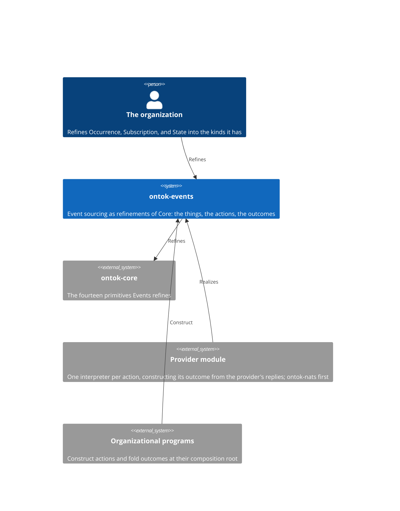

# ontok-events

Events is event sourcing stated in ONTOK: an organization's memory of what occurred, and its work upon that memory, as refinements of Core's primitives. It declares the things, a stream, a version, an occurrence, an event, an expected version, a condition, a read model, a subscription, a checkpoint, a delivery, and the actions upon them with the outcome each can have. It performs no effect. The actions and their outcomes are its whole interface: a provider realizes Events by holding one interpreter per action that constructs that action's outcome from the provider's own replies. Read this page before any structural change and edit the section the change lands in, in the same commit as the code.

## Constraints

- Every declaration is a refinement of a Core primitive or a form of the python-development standard, and carries Core's mandatory configuration unchanged.
- Events depends on `ontok-core` and Pydantic and on nothing else. No declaration names a provider, a transport, or an application.
- Events sits above Core and below every provider in the workspace's import-linter layers contract.
- An event's stream is referenced by `NodeId`; a stream's events are not its constituents.
- `Event.occurrence` and `State.prior` are `SerializeAsAny`: an organization's refinement renders whole, and only the organization's kind constructs it back.
- `Delivery` inherits `action` typed `Action`. That the action is a `Subscription` is not established by construction.
- The occurrences of one `Append` share its stream. That agreement is not established by construction.
- Python 3.14 or later; `pydantic>=2.9,<3`.

## Context

## Building blocks

```mermaid
classDiagram
  class Version { root: int ≥ 0 }
  class Position { root: int ≥ 0 }
  class Expectation { NO_STREAM; ANY }
  class AtVersion { version: Version }
  class VersionMismatch { expected: AtVersion | NO_STREAM; actual: AtVersion | NO_STREAM }
  class Stream
  class Occurrence { version: Version }
  class Event { occurrence: Occurrence; stream: NodeId; position: Position }
  class Events { root: tuple~Event~ ≥ 1 }
  class Occurrences { root: tuple~Occurrence~ ≥ 1 }
  class Append { stream: NodeId; expected: ExpectedVersion; occurrences: Occurrences }
  class Read { stream: NodeId }
  class Initial { stream: NodeId }
  class State { prior: Initial | State; event: Event }
  class ReadModel { state: States; position: Position; persistence() }
  class PersistReadModel { read_model: ReadModel }
  class ReadModelLookup { id: NodeId }
  class NoReadModel { id: NodeId }
  class Start { BEGINNING; NOW }
  class FromPosition { position: Position }
  class Subscription { begins: FromPosition | Start }
  class StreamSubscription { stream: NodeId }
  class NoCheckpoint { subscription: Subscription }
  class Checkpoint { subscription: Subscription; position: Position }
  class ReadCheckpoint { subscription: Subscription }
  class Attempt { root: int ≥ 1 }
  class Delivery { event: Event; attempt: Attempt }
  class End { ACKNOWLEDGE; REJECT; PARK }
  class Ending { delivery: Delivery; end: End }
  class Disposition { delivery: Delivery; end: End }
  core_Entity <|-- Stream
  core_Entity <|-- ReadModel
  core_Event <|-- Occurrence
  core_State <|-- Initial
  core_State <|-- State
  core_Action <|-- Append
  core_Action <|-- Read
  core_Action <|-- Subscription
  Subscription <|-- StreamSubscription
  core_Work <|-- Delivery
  core_Event <|-- Disposition
```

The unions: `ExpectedVersion` is `AtVersion | Expectation`; `StartingPoint` is `FromPosition | Start`. One file holds each meaning: `position`, `value`, `stream`, `event`, `append`, `read`, `state`, `read_model`, `subscription`, `checkpoint`, `delivery`.

The interface, one row per action:

| Action | Outcome |
|--------|---------|
| `Append` | `AppendOutcome`: `Events \| VersionMismatch` |
| `Read` | `ReadOutcome`: `Events \| Literal[Expectation.NO_STREAM]` |
| `Subscription` | the `Subscription` |
| `ReadCheckpoint` | `CheckpointState`: `NoCheckpoint \| Checkpoint` |
| `Ending` | the `Disposition` |
| `PersistReadModel` | the `ReadModel` |
| `ReadModelLookup` | `LookupOutcome`: `ReadModel \| NoReadModel` |

Each bare union has a `TypeAdapter` beside it, named for it with the suffix `Constructor`.

## Construction

A fact comes to exist in three moves and no others.

1. **Refine.** An organization declares its occurrences by subclassing `Occurrence` and adding the fields each carries; its conditions by subclassing `State`; its interests by subclassing `Subscription` or `StreamSubscription`. A refinement adds and never redeclares.
2. **Construct.** An `Occurrence` exists when its identity, when it occurred, and its `Version` are proven. An `Event` exists when its `Occurrence`, its stream, and its `Position` are proven. An `Append` exists when its `Role`, `Goal`, stream, `ExpectedVersion`, and `Occurrences` are proven; it performs nothing. A `State` exists when its prior, an `Initial` or a `State`, and the `Event` folded into it are proven; the fold of a stream is the chain of these. A `Delivery` holds the `Subscription` it undertakes, the `Event` handed to it, and which `Attempt` this is; an `Ending` holds the `Delivery` to end and the `End` it is to have; a `Disposition` holds the `Delivery` it ended and the `End` it had. A `ReadModel` holds `States` and the `Position` they are as of, and derives its own `PersistReadModel`. An outcome exists when its `TypeAdapter` constructs one variant from a provider's reply.
3. **Refuse.** A negative `Version` or `Position`, an `Attempt` of zero, an `Events` or `Occurrences` with no member, a `VersionMismatch` whose actual is `ANY`, a `ReadOutcome` of `ANY`, a `State` without a prior, a `Delivery` without its event or attempt, and any field Core refuses are each refused at construction.

## Decisions

Each is stated as it stands. To change one, change it here and in the code in one commit.

**Event sourcing is refinements of Core.** An occurrence is a Core `Event`, a condition is a Core `State`, an append, a read, and a subscription are Core `Action`s with their `Role` and `Goal`, a delivery is Core `Work`, because the pattern's things are organizational things and Core already distinguishes them. This rules out a parallel vocabulary of event-sourcing types beside the primitives.

**The actions and their outcomes are the interface.** Every duty a provider performs is one action and one outcome union, and nothing else crosses, because a provider is complete when it holds one interpreter per action and that is checkable. This rules out a provider inventing a request, and rules out a separate statement of what a provider must prove.

**An occurrence and an event are two things.** `Occurrence` carries its version; `Event` holds an `Occurrence` with its stream and position, because the organization knows the version when it declares the occurrence and only memory knows the position, and what is appended is not yet what is held. This rules out one type that is sometimes without a position.

**Version and Position are two scalars.** A place in one stream and a place in the log of every stream are different meanings, because an event holds both and they move independently. This rules out one position type serving both.

**Expected version is a model beside a vocabulary.** `AtVersion` carries a fact; no stream and any carry none and form the closed vocabulary `Expectation`, because two empty models cannot be told apart from input while a model and an enum member can. `StartingPoint` has the same shape for the same reason. This rules out empty variants that differ only by class name.

**A mismatch names a version or no stream on both sides.** `VersionMismatch.expected` and `actual` are each `AtVersion | Literal[Expectation.NO_STREAM]`, because a stream is at a version or does not exist, and an append under "any" cannot mismatch. This rules out a mismatch that could not have happened and an actual state that could not have been observed.

**An event references its stream; a stream holds no events.** `Event.stream` is a `NodeId` and `Stream` adds nothing to `Entity`, because a stream exists before its first event and is identified independently of them. This rules out a stream that embeds its history.

**A condition is the transition shape.** `State` holds its prior and one `Event`; `Initial` is the condition before any event, because the fold of a stream is each prior condition plus one event and nothing else. This rules out a state computed by a procedure over a list.

**Interest in a kind of occurrence is refinement.** `Subscription` carries no field naming kinds; an organization subclasses it, because the class is the kind and a field of kinds is a registry. This rules out a subscription that filters by a type name.

**A checkpoint is read, never written.** `Checkpoint` holds a subscription and a position and no action persists it, because the position a subscription has reached is derived from the deliveries it has acknowledged, and a derived fact is never stored beside its source. This rules out a checkpoint write and rules out a checkpoint that carries a write claim.

**An ending is an action and a disposition is what it produced; how is a vocabulary.** `Ending` carries the delivery and an `End`; `Disposition` is a Core `Event` carrying the same, because the intent and the occurrence are different facts with different times, and the three ways to end carry the same fact and are interchange data, so they are one closed vocabulary rather than three identically shaped classes. This rules out a disposition field on `Delivery`, an ending that claims to have happened, and variants that cannot be told apart from input.

**A delivery knows which attempt it is.** `Delivery.attempt` is at least one, because the first delivery is a delivery and a redelivery is a fact a subscription acts on. This rules out at-least-once living only in a provider's promise.

**A read model is an Entity of States at a Position, and it authorizes its own recording.** It reuses Core's `States` and derives `PersistReadModel`, because conditions as of a position are what a read model holds, and the fact that authorizes an effect derives the action for it. This rules out a read model with its own state type and rules out a caller deciding to persist one.

**Events names no provider.** No declaration carries a subject, a sequence header, a consumer, a revision, or any provider's word, because an entry here is true of event sourcing on any provider. This rules out provider shapes in this module.

## Quality scenarios

| Scenario | Expected |
|----------|----------|
| An organization subclasses `Occurrence` with a field, and an `Event` holds it | Constructs |
| A `Version`, `Position`, or `Attempt` is below its bound | Refused |
| An `ExpectedVersion` constructs from `"no_stream"`, `"any"`, and `{"version": 3}` | Three distinct facts |
| A `VersionMismatch` is given `ANY` as its actual | Refused |
| An `Append` is constructed with `NO_STREAM` and one occurrence | Constructs |
| An `Occurrences` or `Events` has no member | Refused |
| `AppendOutcome` is given an `Events` and then a `VersionMismatch` | Each constructs as itself |
| `ReadOutcome` is given `"no_stream"` and then `"any"` | Constructs, then refused |
| A `State` is constructed from an `Initial` and an `Event` | Constructs |
| A `State` is constructed without a prior | Refused |
| `CheckpointState` is given a `NoCheckpoint` and then a `Checkpoint` | Each constructs as itself |
| An `Ending` and a `Disposition` are constructed from one `Delivery` and serialized | Each constructs back with its `End` |
| A `ReadModel` derives its `PersistReadModel` | Holds the read model |
| `LookupOutcome` is given a `NoReadModel` | Constructs as itself |
| Core imports `ontok.events` | The import-linter layers contract fails |

## Glossary

| Term | Meaning |
|------|---------|
| Stream | The events about one entity, identified independently of them. |
| Version | The place an event holds in its stream. |
| Position | The place an event holds in the log of every stream. |
| Occurrence | What the organization declares happened, at its version. |
| Event | An occurrence as memory holds it, in its stream at its position. |
| Expected version | What an append asserts of a stream: at a version, no stream, or any. |
| Append | Occurrences declared for a stream under an expected version. |
| Read | A stream asked for whole. |
| Fold | The condition reached by applying a stream's events in order, each to the prior condition. |
| Read model | Conditions held as of a position. |
| Subscription | A role's standing interest in events, toward a goal, from a starting point. |
| Checkpoint | The position a subscription has reached. |
| Delivery | A subscription's undertaking of one event, on a numbered attempt. |
| End | How a delivery ends: acknowledge, reject, or park. |
| Ending | A delivery to be ended, with its end. |
| Disposition | The occurrence that ended a delivery, with its end. |
| Outcome | The union of facts that can exist after an action; a provider constructs one variant. |
