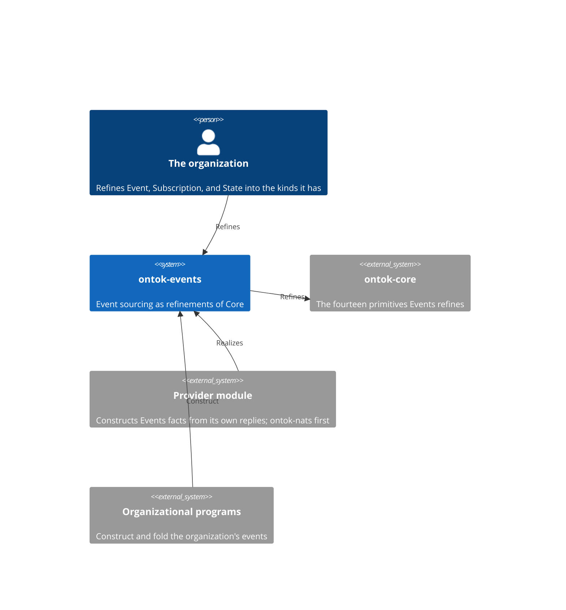

# ontok-events

Events is event sourcing stated in ONTOK: an organization's memory of what occurred, and its work upon that memory, as refinements of Core's primitives. It declares what a stream, a version, an expected version, a condition, a read model, a subscription, a checkpoint, and a delivery are. It performs no effect. A provider realizes it by constructing these facts from its own replies; the organization refines its kinds into the events it actually has. Read this page before any structural change and edit the section the change lands in, in the same commit as the code.

## Constraints

- Every declaration is a refinement of a Core primitive or a form of the python-development standard, and carries Core's mandatory configuration unchanged.
- Events depends on `ontok-core` and Pydantic and on nothing else. No declaration names a provider, a transport, or an application.
- Events sits above Core and below every provider in the workspace's import-linter layers contract.
- An event's stream is referenced by `NodeId`; a stream's events are not its constituents.
- `Delivery` inherits `action` typed `Action`. That the action is a `Subscription` is not established by construction.
- Python 3.14 or later; `pydantic>=2.9,<3`.

## Context

## Building blocks

```mermaid
classDiagram
  class Version { root: int ≥ 0 }
  class Position { root: int ≥ 0 }
  class Expectation { NO_STREAM; ANY }
  class AtVersion { version: Version }
  class VersionMismatch { expected: AtVersion | Expectation; actual: AtVersion | NO_STREAM }
  class Stream
  class Event { stream: NodeId; version: Version; position: Position }
  class Events { root: tuple~Event~ ≥ 1 }
  class Initial { stream: NodeId }
  class State { prior: Initial | State; event: Event }
  class ReadModel { state: States; position: Position }
  class Subscription
  class StreamSubscription { stream: NodeId }
  class Checkpoint { subscription: Subscription; position: Position }
  class Delivery { event: Event }
  class Acknowledgement { delivery: Delivery }
  class Rejection { delivery: Delivery }
  class Parking { delivery: Delivery }
  core_Entity <|-- Stream
  core_Entity <|-- ReadModel
  core_Event <|-- Event
  core_State <|-- Initial
  core_State <|-- State
  core_Action <|-- Subscription
  Subscription <|-- StreamSubscription
  core_Work <|-- Delivery
  core_Event <|-- Acknowledgement
  core_Event <|-- Rejection
  core_Event <|-- Parking
```

`ExpectedVersion` is the union `AtVersion | Expectation`. `Disposition` is the union `Acknowledgement | Rejection | Parking`. One file holds each meaning: `position`, `value`, `stream`, `event`, `state`, `read_model`, `subscription`, `delivery`.

## Construction

A fact comes to exist in three moves and no others.

1. **Refine.** An organization declares its events by subclassing `Event` and adding the fields each carries; its conditions by subclassing `State`; its interests by subclassing `Subscription` or `StreamSubscription`. A refinement adds and never redeclares.
2. **Construct.** An `Event` exists when its identity, when it occurred, its stream, its `Version`, and its `Position` are proven. A `State` exists when its prior, an `Initial` or a `State`, and the `Event` folded into it are proven; the fold of a stream is the chain of these. An `ExpectedVersion` is an `AtVersion` or a member of `Expectation`. A `VersionMismatch` holds what was expected and what was true. A `Checkpoint` holds a `Subscription` and the `Position` it has reached. A `Delivery` holds the `Subscription` it undertakes and the `Event` handed to it; a `Disposition` holds the `Delivery` it ends. A `ReadModel` holds `States` and the `Position` they are as of.
3. **Refuse.** A negative `Version` or `Position`, an `Events` with no member, a `VersionMismatch` whose actual is `ANY`, a `State` without a prior, a `Delivery` without its event, and any field Core refuses are each refused at construction.

## Decisions

Each is stated as it stands. To change one, change it here and in the code in one commit.

**Event sourcing is refinements of Core.** An event is a Core `Event`, a condition is a Core `State`, a subscription is a Core `Action` with its `Role` and `Goal`, a delivery is Core `Work`, because the pattern's things are organizational things and Core already distinguishes them. This rules out a parallel vocabulary of event-sourcing types beside the primitives.

**The propositions are the shapes.** An append lands as an `Event` or is refused as a `VersionMismatch`; a stream reads whole as `Events`; a condition is a `State` folded from its prior; a read model is `States` at a `Position`; a delivery ends as a `Disposition`. A provider proves each by constructing the type. This rules out a separate statement of what a provider must prove.

**Version and Position are two scalars.** A place in one stream and a place in the log of every stream are different meanings, because an event holds both and they move independently. This rules out one position type serving both.

**Expected version is a model beside a vocabulary.** `AtVersion` carries a fact; no stream and any carry none and form the closed vocabulary `Expectation`, because two empty models cannot be told apart from input while a model and an enum member can. This rules out empty variants that differ only by class name.

**A mismatch's actual state is a version or no stream.** `VersionMismatch.actual` is `AtVersion | Literal[Expectation.NO_STREAM]`, because a stream is at a version or does not exist, and "any" is an assertion, not a state. This rules out an actual state that could not have been observed.

**An event references its stream; a stream holds no events.** `Event.stream` is a `NodeId` and `Stream` adds nothing to `Entity`, because a stream exists before its first event and is identified independently of them. This rules out a stream that embeds its history.

**A condition is the transition shape.** `State` holds its prior and one `Event`; `Initial` is the condition before any event, because the fold of a stream is each prior condition plus one event and nothing else. This rules out a state computed by a procedure over a list.

**Interest in a kind of event is refinement.** `Subscription` carries no field naming event kinds; an organization subclasses it, because the class is the kind and a field of kinds is a registry. This rules out a subscription that filters by a type name.

**A checkpoint is separate from its subscription.** `Checkpoint` holds a `Subscription` and a `Position`, because the interest is declared once and the position reached changes. This rules out a subscription that carries its own progress.

**A disposition is an occurrence made of the delivery it ends.** `Acknowledgement`, `Rejection`, and `Parking` are Core `Event`s holding a `Delivery`, because each is something that happened to the delivery at a time, and a delivery holding its own disposition would carry an absent one until it ended. This rules out a disposition field on `Delivery`.

**A read model is an Entity of States at a Position.** It reuses Core's `States`, because conditions as of a position are what a read model holds and Core already has the collection. This rules out a read model with its own state type.

**Events names no provider.** No declaration carries a subject, a sequence header, a consumer, or any provider's word, because an entry here is true of event sourcing on any provider. This rules out provider shapes in this module.

## Quality scenarios

| Scenario | Expected |
|----------|----------|
| An organization subclasses `Event` with a field and constructs it | Constructs |
| A `Version` or `Position` is negative | Refused |
| An `ExpectedVersion` constructs from `"no_stream"`, `"any"`, and `{"version": 3}` | Three distinct facts |
| A `VersionMismatch` is given `ANY` as its actual | Refused |
| A `State` is constructed from an `Initial` and an `Event` | Constructs |
| A `State` is constructed without a prior | Refused |
| An `Events` has no member | Refused |
| A `Checkpoint` is constructed from a `StreamSubscription` and a `Position` | Constructs |
| A `Disposition` is constructed from a `Delivery` | Constructs |
| Core imports `ontok.events` | The import-linter layers contract fails |

## Glossary

| Term | Meaning |
|------|---------|
| Stream | The events about one entity, identified independently of them. |
| Version | The place an event holds in its stream. |
| Position | The place an event holds in the log of every stream. |
| Expected version | What an append asserts of a stream: at a version, no stream, or any. |
| Fold | The condition reached by applying a stream's events in order, each to the prior condition. |
| Read model | Conditions held as of a position. |
| Subscription | A role's standing interest in events, toward a goal. |
| Checkpoint | The position a subscription has reached. |
| Delivery | A subscription's undertaking of one event. |
| Disposition | The occurrence that ends a delivery: acknowledgement, rejection, or parking. |
