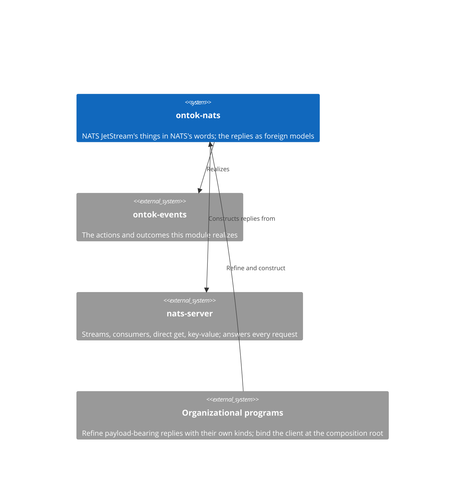

# ontok-nats

NATS is the JetStream realization of Events. It declares NATS's things in NATS's words: the scalars and vocabularies a request or reply is made of, and the replies NATS owns as foreign models constructed whole from what the server answers. Every NATS thing names the Events thing it realizes, or is NATS-only. Read this page before any structural change and edit the section the change lands in, in the same commit as the code.

## Constraints

- Every declaration is a form of the python-development standard: a semantic scalar, a vocabulary, or a foreign model. No NATS thing refines a Core primitive.
- Every constituent is a NATS word. An Events word appears only as the thing a NATS thing realizes, never as a field.
- A foreign model declares the fields the program consumes and no other; `extra="ignore"` because JetStream replies carry fields no duty consumes.
- A header value is text. An integer header constructs through `Json[...]`; a status header constructs through a `Literal` of the vocabulary member. No field is lax.
- A reply whose payload is the organization's own kind declares no payload field. The organization refines the foreign model and adds `data: Json[<its kind>]`.
- NATS depends on `ontok-events`, nats-py, Pydantic, and pydantic-settings. It sits above `ontok.events` in the import-linter layers contract.
- Python 3.14 or later.

## Context

## Building blocks

One file per NATS topic: `stream`, `consumer`, `batch`, `direct_get`, `error`, `kv`, `connection`, `publish`, with `config` for deployment input. `EventSubject` derives `event.<stream>` from a stream identity; `ReadModelKey` derives the key from a read model identity. The reply unions, each with its `TypeAdapter` named with the suffix `Constructor`:

| Reply | Variants | Realizes |
|-------|----------|----------|
| `PublishReply` | `PubAck \| ApiError` | `AppendOutcome`: a `PubAck` is the events landed; an `ApiError` with code 10071 is the `VersionMismatch` |
| `DeliveredMessage` | one shape | `Delivery`: `num_delivered` is the `Attempt`, `reply` is where the `Ending` is sent |
| `KvReply` | `Entry \| Deleted \| NoMessages` | `LookupOutcome`: an `Entry` holds the `ReadModel`; `Deleted` and `NoMessages` are `NoReadModel` |

## Construction

A fact comes to exist in two moves.

1. **Construct the reply whole.** A JSON reply constructs through its union's `TypeAdapter` with `validate_json`. A reply that is a nats-py message constructs with `validate_python(msg, from_attributes=True)`: `AliasPath` reaches `headers` and `metadata`, `Json[...]` turns an integer header's text into its scalar, and the union chooses the variant by which attributes the reply has. A refused request constructs as `ApiError`; a `PubAck` whose `seq` is 0 cannot construct, because `Sequence` begins at 1, so the union falls to the error.
2. **Refuse.** A header with no match, a sequence of zero where a message landed, a status that is not 404, an error code outside JetStream's range, and a subject with a wildcard where a message was published are each refused at construction.

## Decisions

Each is stated as it stands. To change one, change it here and in the code in one commit.

**NATS's things are in NATS's words.** `Sequence`, `Subject`, `ConsumerName`, `Revision`, `Ack`, because the account is NATS's documentation and a constituent that is not its word is a step in disguise. This rules out an Events word as a field in this module.

**A reply is one union per request, constructed whole.** `PublishReply`, `KvReply`, because NATS answers one request with one of a closed set of shapes and construction chooses among them. This rules out parsing a reply field by field and rules out inspecting a status before constructing.

**An error reply is one shape.** `ApiError` holds a `JetStreamError` with its `err_code`, because every JetStream API refusal carries that and the code is what a duty consumes. This rules out an error model per request.

**A zero sequence is not a sequence.** `Sequence` is at least 1, because the first message in a stream is 1 and a refused publish answers 0, so the refusal cannot construct as an acknowledgement. This rules out testing `seq` after construction.

**Integer headers construct through `Json`.** `Nats-Sequence` is text and `Json[Sequence]` constructs the scalar from it, because a header's text is a JSON integer and the scalar stays strict. This rules out lax fields and rules out a scalar typed `str`.

**No field is read that no duty consumes.** `DeliveredMessage` has no message id, no consumer sequence, and no pending count, because a foreign model models what the program consumes and nothing else. This rules out fields kept because the server sends them.

**The payload is the organization's.** `DeliveredMessage` and `Entry` declare no `data`, because the payload is an `Occurrence` or `ReadModel` of a kind only the organization declares, and a refinement adds the field with `Json[<its kind>]`. This rules out a payload typed `bytes` and rules out this module naming an organization's kind.

**Absence is a variant of the reply.** `NoMessages`, `Deleted`, because NATS answers absence with a shape, and that shape constructs. This rules out a caught error or a `None` standing for a missing message.

**The consumer holds the checkpoint.** A durable consumer with explicit acknowledgement holds the position its acknowledgements have reached and resumes from it, because that is what a durable consumer is. This rules out a key-value checkpoint and rules out reading the ack floor, which no duty consumes.

**The subject is the stream's identity.** `EventSubject` is `event.<stream NodeId>`, because a stream's events share one subject and the kind is in the payload, not the subject. This rules out a subject grammar carrying the event type.

**Catch-up and persistent subscription are one thing here.** Every subscription is a durable consumer, because NATS holds the checkpoint either way. This rules out a client-held checkpoint.

## Quality scenarios

| Scenario | Expected |
|----------|----------|
| A publish under `Nats-Expected-Last-Subject-Sequence: 0` on a fresh subject | `PubAck` with `seq` 1 |
| The same publish repeated | `ApiError` with code 10071 |
| A delivered message from a pull consumer | `DeliveredMessage` with `num_delivered` 1 |
| A key put, then read by direct get | `Entry` at revision 1 |
| The key deleted, then read | `Deleted` at revision 2 |
| A key never written, read | `NoMessages` |
| Environment text `NATS_STREAM=EVENTS` | `NatsConfig.stream` is the `StreamName` |

## Glossary

| Term | Meaning |
|------|---------|
| Stream | A JetStream store of messages on a set of subjects. |
| Subject | The dot-separated name a message is published to. |
| Filter subject | A subject with wildcards that selects messages for a consumer or a request. |
| Sequence | The number a stream assigns to a message; the first is 1. |
| PubAck | The acknowledgement of a publish: stream and sequence. |
| Direct get | A request to a stream for the last message on a subject. |
| Consumer | A durable view over a stream that delivers messages and takes acknowledgements. |
| Bucket | A key-value store, itself a stream whose subjects are keys. |
| Revision | The sequence of a key's entry in its bucket. |
| Operation | What an entry did to its key: put, delete, or purge. |
| err_code | JetStream's numeric reason a request was refused. |
| Expected last subject sequence | The header a publish carries asserting the last sequence on its subject. |
| Deliver policy | Where a consumer begins in the stream. |
