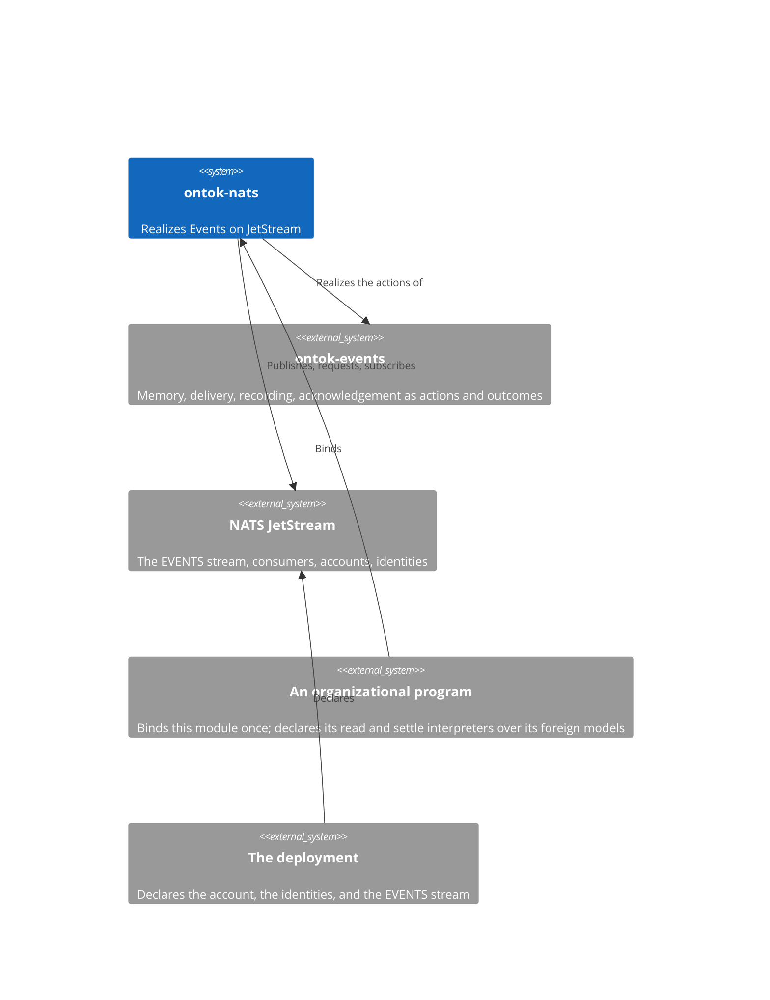
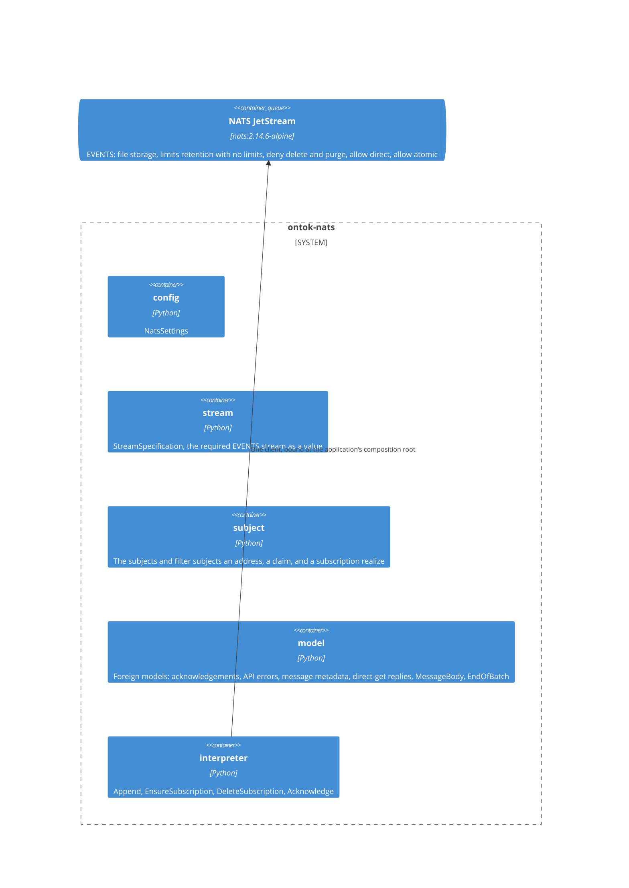

# ontok-nats

NATS is the backend. It carries memory, delivery, and acknowledgement for [ontok-events](./ontok-events.md) on one JetStream stream, and nothing about the organization lives here: no kind, no rule, no meaning. The module holds the provider's configuration, its vocabulary as foreign models, the subjects and headers that realize an address and a claim, and one interpreter per Events action that names no application type: append, ensure, delete, acknowledge. The application's read and settle interpreters are declared by the application over this module's foreign models, because they construct the application's own events. Read this page before any structural change and edit the section the change lands in, in the same commit as the code; Git is the history.

## Constraints

- Every declaration is one of the thirteen forms in the [python-development standard](../../.agents/skills/python-development/SKILL.md) and carries its mandatory configuration. An interpreter performs transport calls and serialization only; provider policy never becomes Events semantics.
- Depends on `ontok-events`, `nats-py`, and `pydantic-settings`. Python 3.14 or later, inherited from Events.
- The server is NATS 2.14.6 or later, because atomic batch publish and batched direct get are required and verified there. The `EVENTS` stream is infrastructure: declared by the deployment, never created by a program, and checked against `StreamSpecification` by the conformance suite.
- A program identity holds exactly the permissions its responsibilities' roles require and no stream administration.
- Every provider behavior this module depends on is confirmed against the server source at v2.14.6, the NATS documentation, or the `nats-py` source, as recorded below; nothing is inferred from a probe.

## Context

## Building blocks

## Startup order

1. The server starts with the account and every identity it will ever need in its configuration.
2. The deployment declares the `EVENTS` stream as `StreamSpecification` states it, through an administrative identity.
3. The application starts as its program identity, binds one client, ensures one durable consumer per responsibility, and registers each callback on its fixed deliver subject.

A step that fails stops the run before the next. The conformance suite runs steps 1 and 2 through testcontainers and proves step 3 against them.

## Construction

### Configuration and the stream

- **`NatsSettings`**, prefix `ONTOK_NATS_`: `url` as the semantic scalar `NatsUrl`, `user` and `password` as `SecretStr`, revealed only while constructing the client. Config.
- **`StreamSpecification`** is the required stream as a value: name `EVENTS`, subject `event.>`, file storage, limits retention with no limits, `deny_delete`, `deny_purge`, `allow_direct`, `allow_atomic`. Value object. The conformance suite constructs the deployed stream's info as a foreign model and compares.

### Subjects

- **An address's subject.** An originating occurrence publishes on `event.<about>.<event_type>.<id>`; a derived one on `event.<about>.<event_type>.<work_type>.<cause>[.<cause>].<position>`, the causes in provenance order. `OriginSubject` and `EmissionSubject` are contract models constructed from an `Address` with `from_attributes=True`, each publishing its dotted `text` as a computed field rendered at the crossing. Subjects are contract models because this program owns the wire name.
- **A claim's subject.** `ExpectSequence` checks `event.<about>.>`, every occurrence about the entity; `ExpectAny` checks the occurrence's own subject.
- **A read's subject.** `OfType` reads the latest on `event.<about>.<event_type>.>`; `EveryType` on `event.<about>.>`; a history walks `event.<about>.>` from sequence 1; an address reads its exact subject.
- **A subscription's filters.** One filter subject `event.*.<event_type>.>` per consumed kind, so a consumer sees every entity's occurrences of those kinds in log order.

### Foreign models

The server's replies, lifted whole, with `extra` matching each source contract: the publish acknowledgement and the batch acknowledgement; the API error with `code`, `err_code`, and `description`; the JetStream message metadata, from which a delivery's log sequence lifts through an `AliasPath`; the direct-get reply, whose `Nats-Sequence` header text constructs `LogSequence` through `model_validate_json`; `EndOfBatch`, the `204 EOB` reply with `Nats-Num-Pending` and `Nats-Last-Sequence`; and `MessageBody`, the source-owned scalar over a message's bytes that the application's route names as the fallback of its event union.

### Interpreters

One per Events action meaning; each holds its action and the one client, composes its subject and headers at the call, and translates only its documented failures into the action's unavailable outcome. `CancelledError`, `KeyboardInterrupt`, and `SystemExit` propagate; anything else is a defect.

- **`AppendInterpreter`** publishes each event with `Nats-Batch-Id`, `Nats-Batch-Sequence` from 1, the claim's headers on the first (`Nats-Expected-Last-Subject-Sequence: 0` on its own subject, and for `ExpectSequence` `Nats-Expected-Last-Subject-Sequence-Subject: event.<about>.>` with the sequence), and `Nats-Batch-Commit: 1` on the last, which is a request whose reply acknowledges the whole batch. `nats-py` has no batch call, so the interpreter sets the headers itself. An append of no events makes no call and is `Written`. A publish acknowledgement is `Written`; API error 10071, wrong last sequence, is `Contested` carrying its description as the refusal; every other documented failure is `AppendUnavailable`.
- **`EnsureSubscriptionInterpreter`** creates, through the consumer API, a durable push consumer named `<work_type>`, with the subscription's filter subjects, deliver subject `_INBOX.ontok.<work_type>`, deliver group `<work_type>`, explicit acknowledgement, `max_ack_pending` 1, acknowledgement wait 30 seconds, unlimited deliveries, deliver-all, no flow control. Creating it again with the same configuration is `SubscriptionEnsured`; a documented failure is `EnsureUnavailable`.
- **`DeleteSubscriptionInterpreter`** deletes that consumer: `SubscriptionDeleted`, or `Unavailable`.
- **`AcknowledgeInterpreter`** publishes to the delivery token: `+ACK` for Complete, `-NAK` for Retry, `+TERM` for Reject; `Acknowledged`, or `Unavailable`.
- **The application's read interpreters** request `$JS.API.DIRECT.GET.EVENTS` in the body form, `{"last_by_subj": "<subject>"}`, constructing `Retained` from the reply and `Absent` from a 404. A history interpreter subscribes an inbox, publishes `{"seq": <next>, "next_by_subj": "event.<about>.>", "batch": <n>}` with that inbox as its reply, and constructs from the replies until `EndOfBatch`: the first page requests one message, each later page requests the previous `EndOfBatch`'s `Nats-Num-Pending` from after its `Nats-Last-Sequence`, and the history ends at an `EndOfBatch` with nothing pending. **The settle interpreter** reads an answer's addresses the same way and returns `Settled`.
- **The callback** is bound by the application with `subscribe_bind` on the consumer's deliver subject with manual acknowledgement, which subscribes with the deliver group as its queue, so each occurrence reaches exactly one running instance and the binding survives the consumer's deletion and recreation.

### The program identity

Publish on `event.>`; `$JS.API.INFO`; `$JS.API.STREAM.INFO.EVENTS`; `$JS.API.DIRECT.GET.EVENTS`; `$JS.API.CONSUMER.CREATE.EVENTS` and `$JS.API.CONSUMER.CREATE.EVENTS.>`; `$JS.API.CONSUMER.INFO.EVENTS.*` and `$JS.API.CONSUMER.DELETE.EVENTS.*`; `$JS.ACK.EVENTS.>` and `$JS.ACK.*.*.EVENTS.>`. Subscribe on `_INBOX.>`. Nothing else. These permissions are the realization of the authority of the roles the program's responsibilities act through.

### Files

`config.py`, `stream.py`, `subject.py`, `model.py`, `interpreter.py`. The conformance suite and its testcontainers fixture live in the package's `tests`.

## Decisions

Each is stated as it stands. To change one, change it here and in the code in one commit.

**One stream per account, keyed by subject.** Every occurrence lives in `EVENTS` under `event.<about>.<event_type>...`, because an address is a fact about an entity, a kind, and a publication, and a subject can carry all three while a stream per entity cannot exist at an organization's scale. This rules out a stream per entity or per kind, and rules out any organization prefix, since accounts isolate organizations.

**A claim is an expected-last-subject-sequence header, and a wildcard makes it a claim about the entity.** `ExpectSequence` sends `Nats-Expected-Last-Subject-Sequence-Subject: event.<about>.>`, because the server resolves that header through the same last-message load as a direct get and honors a wildcard there, so one header proves the latest occurrence about the entity. This rules out a per-subject sequence check that could not see other kinds.

**An append is an atomic batch with hand-set headers.** Emissions are committed with `Nats-Batch-Id`, `Nats-Batch-Sequence`, and a committing request, because `allow_atomic` makes the batch land whole or not at all and `nats-py` offers no batch call. This rules out a transaction emulated by ordering and rules out any batch larger than the server's thousand.

**Error 10071 is a contest and nothing else is.** A wrong-last-sequence reply is `Contested` and is settled by reading the address, because the error's description carries the latest sequence only as text and the address, not the number, is what decides whether this publication is already remembered. This rules out parsing the description and rules out treating any other failure as a contest.

**Reads are direct gets in the body form.** `last_by_subj` over a wildcard returns the latest occurrence in scope, because the server serves it through a last-message load that scans matching subjects, while the client's subject-form request cannot carry a wildcard. This rules out `get_msg` and rules out a read consumer.

**A history is a batched direct get through an inbox.** A history walks `next_by_subj` in pages ending in `EOB`, through a subscription the request names as its reply, because a batched get answers with one reply per message and the client's `request` returns only the first. This rules out reading a history through `request` and rules out a consumer per read.

**One durable push consumer per responsibility, with a deliver group and one message in flight.** The consumer is named by `work_type`, delivers on a fixed inbox subject to a queue group of the same name, and allows one unacknowledged message, because that is what makes delivery ordered across every consumed kind, reach exactly one instance, and survive a process without a receive loop. This rules out pull consumers, ephemeral consumers, and parallelism within a responsibility.

**Delivery from the beginning, redelivered without limit, within a thirty-second wait.** Deliver-all, unlimited deliveries, and an acknowledgement wait that bounds a whole delivery, because a responsibility's interest is the entire memory, a retry is the only recovery, and idempotence makes redelivery harmless. This rules out deliver-new, poison thresholds, and a delivery longer than the wait.

**Acknowledgement is a publish to the token.** Complete, Retry, and Reject are `+ACK`, `-NAK`, and `+TERM` on the message's reply subject, because those are the three dispositions the server knows and the token is where it listens. This rules out any fourth disposition and rules out acknowledging through the message handle inside a domain value.

**The stream is infrastructure and conformance is a test.** The deployment declares `EVENTS`; the module states what it must be and proves a deployment against it, because a program that creates its own storage holds an authority its role does not have. This rules out stream administration in any program identity.

**Header text becomes a sequence through JSON construction.** A `Nats-Sequence` header constructs `LogSequence` through `model_validate_json`, because the text is a JSON number and strict construction from JSON is the admitted path, while lax mode is not. This rules out `int()` and rules out a lax foreign model.

**The application declares the interpreters that construct its events.** Read and settle interpreters live in the application over this module's foreign models, because they return `Retained` holding the application's own kinds, which this module cannot name. This rules out a generic read interpreter and rules out this module importing anything above it.

## Provider facts relied on

Each is verified at the cited source; none is inferred.

- **Latest over a wildcard.** Direct get's `last_by_subj` is served through `store.LoadLastMsg` (`stream.go` line 6093 at v2.14.6); the file store's `loadLastLocked` branches on `subjectHasWildcard` and scans matching subjects, and request validation does not reject a wildcard.
- **As of now only.** A `last_by_subj` read ignores `up_to_seq`; only `multi_last` honors it, returning the last message of every distinct matching subject.
- **Claim over a wildcard.** `Nats-Expected-Last-Subject-Sequence-Subject` replaces the checked subject and calls the same last-message load (`stream.go` lines 6453 to 6479); an expected 0 with no match passes.
- **Wrong last sequence.** The failure answers with API error 400, `err_code` 10071; the reply carries only `code`, `err_code`, and `description`.
- **Atomic batches.** `allow_atomic` accepts `Nats-Batch-Id`, `Nats-Batch-Sequence`, and `Nats-Batch-Commit`; the default batch limit is 1,000; a per-subject expectation is allowed on a subject not already written in the batch; the only refused expectation header is `Nats-Expected-Last-Msg-Id`; `nats-py` supports the stream setting and has no batch publish.
- **Batched history reads.** `JSApiMsgGetRequest` carries `batch` with `next_by_subj`, which may be a wildcard (`jetstream_api.go` lines 673 to 695); each batched reply carries `Nats-Num-Pending` and `Nats-Last-Sequence`; a batch ends with `204 EOB` carrying `Nats-Num-Pending` (`stream.go` lines 5916 to 5918); a batch stops early at `max_bytes`, defaulting to the server's maximum pending size.
- **One reply per request.** `nats-py`'s `request` returns the first reply to its inbox.
- **Body form required.** `nats-py`'s `get_msg(direct=True, subject=...)` sends `$JS.API.DIRECT.GET.<stream>.<subject>`, and a request subject cannot contain a wildcard.
- **Consumers.** Several `filter_subjects` are supported from server 2.10; a consumer is created on `$JS.API.CONSUMER.CREATE.<stream>`, so its permission is scoped by stream; `ConsumerConfig` carries `filter_subjects`, `deliver_subject`, `deliver_group`, `max_ack_pending`, `ack_wait`, and `deliver_policy`.
- **Names.** Stream and consumer names cannot contain whitespace, `.`, `*`, `>`, path separators, or non-printable characters; the hyphen in `<namespace>-<Class>` is valid in both a name and a subject token.
- **Push binding.** `subscribe_bind` binds a callback to an existing consumer's deliver subject and subscribes with the consumer's `deliver_group` as its queue.
- **Acknowledgements.** `+ACK`, `-NAK`, and `+TERM` are published on the message's reply subject.
- **Terminate advisory.** A terminate publishes on `$JS.EVENT.ADVISORY.CONSUMER.MSG_TERMINATED.<stream>.<consumer>` for operators.

## Quality scenarios

The conformance suite starts `nats:2.14.6-alpine@sha256:ad7a43eb7e3337c3c38ce5d784d1461791f95f730f252d2b25eee699752a0ca3` through testcontainers with an account, an administrative identity, a program identity, and the `EVENTS` stream, and proves each row against it through a test-owned ontology that declares its route and read interpreters.

| Scenario | Expected |
|----------|----------|
| A deployed stream differs from `StreamSpecification` | Conformance fails naming the difference |
| An occurrence is published on its subject | Its consumer, filtered by kind, receives it and no other |
| The same publication is appended again under each claim, after another occurrence has landed on the entity | `Contested`, settled as `AlreadyPresent`; one copy |
| An append claims a sequence the entity has passed | `Contested`, settled as `Conflict` |
| A batch's claim fails | No event of the batch lands |
| A batch is contested | It settles as `AlreadyPresent` from its lead's address |
| The latest is read by kind, by every kind, and by exact address; and an entity has nothing | Each returns the right occurrence; `Absent` |
| A history longer than one page is read | Every occurrence, in order, and nothing twice |
| A consumer filters several kinds | Deliveries arrive in log order across them |
| Two instances share a deliver group | Each occurrence reaches exactly one |
| The server restarts | The consumer resumes from where it acknowledged |
| Complete, Retry, and Reject are acknowledged | The message is done, redelivered, and terminated respectively |
| The consumer is deleted and recreated | The callback bound to the fixed deliver subject keeps receiving |
| The program identity creates a stream | Refused by permissions |

## Glossary

| Term | Meaning |
|------|---------|
| Subject | The dotted name an occurrence is published on; carries its address. |
| Filter subject | What a consumer listens for: one per consumed kind, across every entity. |
| Claim header | `Nats-Expected-Last-Subject-Sequence` with its optional `-Subject`, realizing an expectation. |
| Batch | A set of publishes sharing a `Nats-Batch-Id`, committed by the last, landing whole or not at all. |
| Direct get | A request to `$JS.API.DIRECT.GET.EVENTS` answered from the stream without a consumer. |
| EndOfBatch | The `204 EOB` reply that ends a batched direct get, carrying what is still pending. |
| Consumer | The durable push consumer that is a responsibility's subscription on the server. |
| Deliver group | The queue group of a consumer's deliveries; one instance per occurrence. |
| Token | The message's reply subject, where an acknowledgement is published. |
| Program identity | The NATS user a program runs as; its permissions realize its roles' authority. |
| Conformance | The suite that proves a deployment and the server behave as this page states. |
